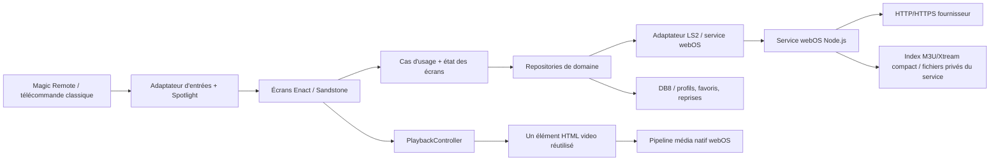

# Spécification technique — lecteur IPTV LG webOS TV 6+

**Version :** 1.1 — **Date :** 28 septembre 2026<br>
**Statut :** spécification de conception, à valider sur téléviseurs réels avant implémentation complète<br>
**Langue de l’interface :** français par défaut, architecture prête pour la localisation

> But : développer un lecteur IPTV webOS clair, utilisable entièrement à la télécommande et réactif sur un téléviseur LG de gamme moyenne. L’application lit uniquement les sources fournies par l’utilisateur. Elle ne fournit ni playlist, ni chaîne, ni compte, ni contenu audiovisuel.

## 0. Décisions recommandées

| Sujet | Décision de référence | Motif |
|---|---|---|
| Type d’application | **Application web empaquetée** (`.ipk`), avec toutes les ressources d’interface dans le paquet | Le premier écran doit s’afficher sans attendre un serveur d’application distant ; LG distingue les apps empaquetées des apps hébergées dont le démarrage dépend du serveur. [S09] |
| Framework UI | **Enact 3.4.9 + Sandstone 1.4.6** pour couvrir webOS TV 6.0 | La matrice LG associe précisément webOS 6.0 à cette version. Enact 4 a abandonné le support de la génération TV 2021, donc ne convient pas à la borne minimale demandée. [S02][S03] |
| Langage | **TypeScript**, compilé en JavaScript pour la TV | Types pour les réponses Xtream/M3U/EPG incohérentes, refactorings plus sûrs ; Enact CLI prend en charge TypeScript. [S04] |
| Navigation télécommande | **`@enact/spotlight`**, intégré à Enact/Sandstone | Gestion de focus 5-way, des conteneurs et du mode pointeur ; les composants Sandstone navigables sont déjà intégrés à Spotlight. [S05][S06] |
| Réseau fournisseur | **Service JavaScript webOS** (Node.js 8.12 sur webOS 6) pour réseau/parsing, avec index compact et paginé des catalogues M3U/Xtream dans son répertoire privé | Sa mémoire n’est pas durable et le service peut être arrêté après inactivité ; son stockage de fichiers est distinct de DB8. Le TLS et les certificats du Node embarqué doivent être validés séparément du navigateur et du lecteur. [S11][S32][S33] |
| Lecture | Élément **HTML `<video>` natif** et pipeline média webOS, URL de flux fournie par le profil | HLS est pris en charge, mais live MPEG-TS progressif, MIME, redirects, codecs et protocoles doivent passer la matrice phase 0 avant d’être annoncés comme compatibles. [S14][S15][S35] |
| Persistance | **DB8** pour profils, favoris, préférences et reprise ; **index catalogue compact sur disque privé du service** ; aucune passphrase obligatoire en V1 | La menace locale est explicitée §8. Les index/caches sont reconstruisibles ; DB8 ne reçoit pas tout le catalogue. [S17][S19][S33] |

**Prototype et go/no-go obligatoires avant l’UI complète :** tester Enact/Spotlight, LS2 et le stockage sur une TV webOS 6 ; confronter le service et le `<video>` à au moins deux portails Xtream autorisés et deux playlists M3U autorisées, couvrant MPEG-TS progressif, HLS, URL sans extension, redirect inter-hôte, HTTP, HEVC, AC-3/E-AC-3 et 1080i. Critères initiaux : au moins 9 lancements réussis sur 10 pour chaque cas déclaré supporté, première image p95 ≤ 15 s sur réseau de labo stable, aucune fuite de session visible après zapping. Le Simulator webOS 6.0 ne remplace pas le test TV. [S14][S15][S24][S35]

---

## 1. Objectifs, périmètre et limites

### 1.1 Objectifs produit

1. Présenter quatre entrées principales sur l’accueil : **Live TV**, **VOD**, **Séries** et **Profil**.
2. Ajouter et modifier une source **Xtream-compatible** ou une **URL de playlist M3U** depuis Profil.
3. Parcourir rapidement de gros catalogues au D-pad et à la Magic Remote.
4. Afficher le programme courant et le programme suivant quand un EPG est disponible.
5. Lancer des flux compatibles avec le pipeline média du téléviseur, sans bloquer l’interface.
6. Expliquer les erreurs de manière compréhensible et proposer une action utile : réessayer, changer de source, revenir au catalogue ou corriger le profil.
7. Garder l’écran et la navigation utilisables en cas de perte de réseau, de catalogue vide ou d’indisponibilité EPG.

### 1.2 Inclus dans la V1

- Gestion locale d’un ou plusieurs profils fournisseur, un profil actif à la fois ; enregistrement des secrets selon le choix de persistance expliqué §8.
- Live TV, catégories, chaînes, favoris et informations EPG courant/suivant.
- VOD, catégories, affiches/posters, recherche globale, saut alphabétique, fiche courte et lecture.
- Séries, catégories, recherche globale, saut alphabétique, fiche série, sélection de saison, liste d’épisodes et lecture.
- Masquage et réordonnancement local des catégories, sans prétention de contrôle parental.
- Lecture des formats réseau réellement validés en phase 0 sur les appareils ciblés ; aucune garantie universelle par extension.
- États chargement/vide/erreur, reprise manuelle et reconnexion contrôlée.
- Aucun espace publicitaire vide dans la V1 : le panneau EPG utilise toute sa colonne. Un emplacement rétractable pourra être activé ultérieurement uniquement quand une annonce existe.
- Mode pointeur Magic Remote en complément ; aucune fonction essentielle ne dépend du pointeur.

### 1.3 Hors périmètre / non garantis

- Fourniture, découverte, partage ou vente de playlists, identifiants ou chaînes.
- Contournement d’un DRM, d’un abonnement, d’une restriction régionale ou d’un contrôle d’accès.
- Enregistrement vidéo, timeshift/catch-up, contrôle parental, multi-écran, cast, téléchargement ou lecture hors ligne.
- Promesse de prise en charge de tout flux `.ts`, RTSP, RTMP, MPEG-DASH, de tout codec, ou de tous les tags HLS. Les limites webOS et du serveur source s’appliquent. [S14][S15]
- Publicités tierces avant consentement et intégration d’un SDK publicitaire dans cette spécification.

**Conformité :** l’utilisateur doit posséder ou être autorisé à utiliser les sources configurées. Les mentions légales, la politique de confidentialité et toute déclaration demandée par LG doivent être fournies avant distribution.

---

## 2. Recherche : choix du langage, framework et architecture

### 2.1 Contraintes concrètes du runtime

- webOS TV 6.x utilise **Chromium 79**. Les générations suivantes ont des moteurs plus récents, mais le build doit rester compatible avec Chromium 79 si webOS 6 est réellement supporté. Vérifier les propriétés CSS récentes sur ce moteur : ne pas dépendre de `gap` sur un conteneur flex ou de `aspect-ratio` sans fallback, et tester chaque API navigateur au lieu de supposer qu’une transpilation TypeScript suffit. [S01]
- Une application TV webOS est une application web HTML/CSS/JavaScript. Un framework webOS TV n’est pas une application React Native native. [S01]
- Le tableau de compatibilité LG indique **Enact 3.4.9 / Sandstone 1.4.6** pour webOS 6.0. Enact 4 ne prend plus en charge les téléviseurs 2021 ou antérieurs : un build V1 commun webOS 6+ doit donc rester sur la branche Enact 3 validée, ou maintenir des builds distincts après essais. [S02][S03]
- webOS prend en charge deux modes de contrôle Magic Remote : pointeur et navigation 5-way. LG impose de concevoir aussi pour le 5-way ; les flèches et OK doivent suffire à accomplir tout le parcours. [S06]
- La lecture vidéo dépend de l’appareil, du manifeste, du codec, du profil, du débit et du serveur. L’émulateur/simulateur ne reproduit pas fidèlement toutes les capacités média du téléviseur. [S14][S15][S24]

### 2.2 Comparaison des options

| Option | Avantages | Limites pour ce produit | Décision |
|---|---|---|---|
| **Enact 3 + Sandstone + Spotlight** | Écosystème LG, composants 10-foot, focus 5-way et pointeur intégrés, virtualisation de listes, TypeScript, outillage Enact. [S02][S04][S05][S08] | Framework React et rendu DOM : impose de virtualiser et de limiter les mises à jour/effets. Les composants et les versions doivent rester compatibles avec webOS 6. | **Choix V1** : meilleur équilibre entre compatibilité officielle, télécommande et maintenabilité pour l’interface demandée. |
| React + **Norigin Spatial Navigation** | Bonne bibliothèque de navigation spatiale pour React, annoncée pour webOS et d’autres TV web. [S26] | Remplace/duplique une partie de la navigation déjà fournie par Enact/Sandstone ; risque de deux gestionnaires de focus concurrents. | Ne pas ajouter si Spotlight est utilisé. Alternative seulement si l’UI abandonne Enact. |
| **Lightning 3 / Blits** | Framework conçu pour les interfaces TV ; rendu orienté performance et animations sur appareils contraints. [S27] | Modèle de rendu et composants différents, intégration du focus, du pointeur et du pipeline vidéo à prouver sur une TV webOS 6 réelle. Le gain n’est pas garanti sans benchmark sur le matériel visé. | Alternative à prototyper si les mesures Enact échouent, pas une seconde couche à mélanger à la V1. |
| React/DOM sans bibliothèque de focus | Liberté et dépendances potentiellement réduites. | Il faudrait réimplémenter le focus spatial, les frontières, le retour de focus et le scroll par télécommande ; risque élevé de régressions. | Rejeté pour ce besoin où la télécommande est centrale. |

### 2.3 Langage et compilation

- Écrire l’interface et les adaptateurs de données en **TypeScript** ; le code exécuté reste du JavaScript compilé. Activer `strict` dans `tsconfig` et garder les réponses réseau au type `unknown` jusqu’à leur validation runtime : les types TypeScript ne valident pas les données du fournisseur.
- Utiliser la version Enact CLI compatible avec Enact 3.4.9 ; figer toutes les dépendances dans un lockfile et contrôler leurs versions dans CI.
- Cibler explicitement **Chrome 79** dans Browserslist et compiler la syntaxe vers `target: ES2018` (ou plus ancien) : le compilateur doit transformer `?.`/`??` en syntaxe antérieure. Bloquer en CI tout bundle qui contient une syntaxe post-ES2018 non transformée (parse AST en `ecmaVersion: 2019` ou analyse équivalente).
- La cible syntaxique ne polyfill pas les APIs : interdire/remplacer `String.prototype.replaceAll` et toute méthode absente de Chromium 79, ou ajouter un polyfill ciblé. Activer un lint de compatibilité basé sur Browserslist puis exécuter le bundle de production sur Chromium 79 réel/épinglé et une TV.
- Produire un paquet de production statique (bundles locaux, CSS et assets locaux) avec le build production Enact, qui minifie et regroupe le code de l’application. [S10] Pas de `import()`/chargement de chunks à l’exécution dans la V1 empaquetée ; pas de dépendance à un serveur web distant pour dessiner l’interface.
- Éviter les syntaxes et APIs plus récentes sans transpilation/polyfill vérifié sur webOS 6. Ne pas confondre transpilation TypeScript et polyfill des APIs navigateur.

### 2.4 Architecture retenue

Architecture en couches et adaptateurs (ports/adapters), sans serveur cloud obligatoire :



**Responsabilités :**

- `ui/` : écrans et composants Enact/Sandstone ; aucun appel HTTP fournisseur directement dans un composant visuel.
- `domain/` : profils, chaînes, catégories, films, séries, épisodes, programmes EPG, favoris, erreurs normalisées.
- `application/` : cas d’usage (`testerProfil`, `chargerCategories`, `chargerElementsCategorie`, `lireChaine`, `reprendreVOD`, etc.).
- `providers/xtream/` : appels du dialecte Xtream et normalisation des réponses variables.
- `providers/m3u/` : téléchargement et parsing de playlist ; regroupement des entrées et extraction des métadonnées courantes.
- `epg/` : adaptation XMLTV/Xtream, correspondance chaîne-programmes et sélection courant/suivant.
- `platform/webos/` : LS2, cycle de vie, DB8, état réseau, saisie/clavier virtuel, clés système, capacités média.
- `services/provider-service/` : service JS webOS compact pour les requêtes fournisseur et traitements hors UI ; Node.js 8.12.0 est la version documentée pour webOS 6. [S11]
- `ServiceCatalogStore` : index compact M3U et index de recherche pour catalogues Xtream en fichiers du service, écrit/relu par pages ; quand l’API Xtream ne pagine pas, ingérer son tableau JSON par flux/parseur incrémental vers le même index. Le processus peut disparaître entre deux appels et n’est jamais la source de durabilité. DB8 ne reçoit que profils, préférences, favoris, correspondances et reprises.
- `player/` : interface `PlayerAdapter` et implémentation `NativeHtmlVideoPlayer`. L’UI du lecteur ne connaît pas les détails du fournisseur.

Le service JS webOS ne doit pas être un serveur de longue durée ni un proxy ouvert. LG documente son lancement à la demande et un délai d’inactivité de 5 s sans activité LS2 ; un service actif ne doit pas être supposé persister en mémoire après une réponse. Il s’exécute dans un environnement isolé ; ses fichiers peuvent être conservés sous `/media/internal` et réutilisés avec le même UID. [S11][S32][S33]

- `services.json` n’expose que des commandes étroites (`importPlaylist`, `getPage`, `cancelOperation`, etc.) ; conserver `public:false` (valeur par défaut) et ne jamais publier un proxy générique. Vérifier sur TV les règles effectives d’appelant/LS2 et n’accepter que l’ID de profil et les opérations attendus. [S34]
- Un import garde une requête/abonnement LS2 active uniquement tant que l’utilisateur le suit, publie la progression et accepte une annulation ; ne pas installer un keep-alive permanent ni laisser le service travailler en arrière-plan. LG déconseille les services qui restent actifs plusieurs minutes. [S32][S33]
- Favoriser chunks HTTP Range/ETag si le serveur les supporte et checkpoint d’index temporaire ; sinon un seul flux asynchrone peut rester actif pendant l’import, mais son temps/RSS doivent passer la qualification phase 0. Si la TV termine le service ou si la durée sûre est dépassée, supprimer la transaction temporaire, garder l’ancien index et proposer de reprendre/recommencer. Le process peut rouvrir l’index validé au prochain appel.
- Le service parse M3U/XMLTV en flux et par lots sur son event loop ; pas de `worker_threads` requis ni supposé sur Node 8.12. Toute étape CPU longue cède la main régulièrement pour traiter annulation, progression et appels LS2.
- Les méthodes LS2 imposent pagination/chunks bornés ; le service limite tailles reçues et répond, ferme les requêtes annulées et n’écrit jamais d’identifiants ou d’URLs authentifiées dans ses logs.

### 2.5 Paquet empaqueté, CORS et accès fournisseur

**Problème à traiter dès le prototype :** webOS applique la politique CORS du navigateur. Les portails Xtream et les URLs M3U ne configurent pas tous les en-têtes CORS nécessaires. LG décrit CORS comme une configuration côté serveur ; le forum développeur webOS précise qu’une app empaquetée n’a pas d’origine HTTP classique, ce qui peut rendre les requêtes API navigateur incompatibles avec certains fournisseurs. [S12][S13]

**Décision :** les appels API, le téléchargement M3U et l’EPG passent par le service JS webOS et ses requêtes réseau ; l’interface reçoit des objets JSON normalisés, paginés/chunkés. Le lecteur vidéo reçoit directement l’URL de média et ne lit pas les segments avec du JavaScript. Ne jamais désactiver CORS, ni faire passer les identifiants via un proxy cloud invisible.

**TLS par pile :** le tableau LG confirme TLS 1.2/1.3 au niveau webOS, mais cela ne prouve pas que le client HTTPS du service Node 8.12 négocie TLS 1.3 ou utilise le même magasin de certificats que Chromium/le pipeline média. Le tag Node.js 8.12.0 upstream embarque OpenSSL 1.0.2p, qui ne fournit pas TLS 1.3 ; le build LG peut différer et n’est pas documenté à ce niveau. Lire uniquement la version non sensible `process.versions.openssl` sur l’appareil, puis tester la même API sur TLS 1.2, TLS 1.3-only et certificats publics représentatifs. Exiger TLS 1.2 comme baseline du service ; annoncer TLS 1.3 que si le prototype appareil le démontre. Aucun contournement TLS ni ajout silencieux de CA privée. [S28][S36]

**Protection contre URL malveillantes/redirects :** toutes les URL M3U/EPG/stream sont non fiables. Pour les appels HTTP exécutés par le service, limiter les redirects à 5, revalider schéma/port/hôte à chaque saut, résoudre chaque nom et épingler l’IP publique validée via le callback DNS du client HTTP ; bloquer loopback, link-local, multicast et plages privées par défaut. Pour un serveur LAN, demander une autorisation explicite par profil et ne pas autoriser les redirects hors de cette plage. Ne jamais transférer `Authorization`/cookies à un autre origin.

**Limite du `<video>` natif :** le media pipeline résout DNS et suit ses redirects lui-même ; l’app n’a pas de hook documenté pour pinner l’IP au socket. Avant de lui donner une URL, appliquer un contrôle best-effort de schéma/host et tester les redirects connus ; signaler explicitement que l’app ne peut ni pinner l’IP ni garantir l’inspection de chaque redirect du chemin média sans proxy. N’accepter que les URLs du profil actif/import choisi, jamais une URL issue d’un champ HTML arbitraire. Si une menace SSRF forte est exigée, réévaluer un relais local opt-in plutôt que prétendre au pinning complet.

Si le service local ne fonctionne pas avec un fournisseur ou est bloqué par une exigence de distribution, solutions de repli explicitement opt-in :

1. demander au fournisseur une API/configuration autorisant l’accès ;
2. proposer un pont local que l’utilisateur héberge et configure lui-même ;
3. éventuellement proposer un service relais documenté, avec consentement clair, politique de confidentialité, chiffrement et divulgation des données transmises.

Un relais distant n’est **pas** le comportement par défaut.

---

## 3. Parcours et exigences fonctionnelles

### 3.1 Accueil — quatre choix primaires

L’accueil comprend quatre grandes cartes/boutons, sans menu d’icônes ambigu :

1. **Live TV**
2. **VOD**
3. **Séries**
4. **Profil**

Chaque carte a un intitulé lisible, une icône simple, un état de focus très visible et un aperçu visuel discret. Le profil actif peut être indiqué dans l’en-tête. Si aucun profil n’est configuré, les sections de contenu expliquent qu’une source est nécessaire et le focus peut aller directement vers **Profil**, sans supprimer les quatre entrées.

### 3.2 Live TV

Disposition cible en 16:9 :

```text
┌────────────────┬──────────────────────┬───────────────────────────────┐
│ Catégories     │ Chaînes               │ EPG de la chaîne sélectionnée │
│ panneau gauche │ panneau central       │ panneau droit pleine hauteur  │
│                │                       │                               │
└────────────────┴──────────────────────┴───────────────────────────────┘
```

- Le panneau catégories et le panneau chaînes sont adjacents, séparés par une bordure ou un faible espace ; ils ne doivent pas paraître comme deux pages distinctes.
- Le panneau de droite donne la priorité à l’EPG et l’affiche sur toute la hauteur en V1 ; aucun bloc vide ou intitulé « publicité » n’est affiché.
- La sélection d’une chaîne met à jour son nom, logo disponible, programme courant, horaires, progression, description courte et programme suivant. **La sélection seule ne lance pas le flux** ; OK ouvre le lecteur.
- Le panneau EPG fonctionne même si le flux n’est pas lancé. Un EPG absent ou non apparié donne un état « Guide non disponible » sans bloquer les chaînes.
- Une régie/ad slot futur est rétracté par défaut et ne se déplie qu’avec une annonce effectivement disponible, consentie et conforme ; il ne prend jamais le focus ni ne retarde la lecture.
- États à concevoir : aucune catégorie, aucune chaîne, chargement, favoris vides, EPG absent, réseau indisponible, erreur fournisseur, source non compatible.
- Actions V1 : ajouter/retirer des favoris, rafraîchir la source depuis Profil et rechercher une chaîne dans toutes les catégories visibles avec le clavier virtuel ; la saisie vocale fournie par le clavier reste optionnelle et ne remplace pas le saut alphabétique.

### 3.3 VOD

- Catégories à gauche ; à droite, la plus grande zone d’écran est une grille virtualisée de films.
- En tête de la grille : recherche globale sur tous les films des catégories visibles du profil, saisissable au clavier virtuel, plus saut alphabétique adapté à la locale (A–Z/# en français, ordre arabe en RTL), utilisable au D-pad ; résultat limité et paginé par le service.
- Debounce de recherche de 250 ms, annulation des requêtes obsolètes, accents/casse normalisés ; OK sur un résultat ouvre sa fiche et Back restaure query, lettre, catégorie, scroll et focus.
- Poster de taille modérée, jamais une affiche plein écran dans la grille. Afficher le titre et, si disponibles, année/durée/notation ; les données manquantes ne doivent pas créer de trous visuels.
- La grille doit rester parcourable si les posters sont absents ou lents : placeholder immédiat, chargement différé, image de repli en cas d’échec.
- OK sur un poster ouvre une fiche (titre, affiche, résumé, durée, année, bouton Lire, favori). OK sur **Lire** ouvre le lecteur.
- Après retour du lecteur, restaurer catégorie, index sélectionné, scroll et focus.

### 3.4 Séries

- Catégories à gauche ; grille de séries virtualisée dans le panneau principal.
- Recherche globale sur toutes les séries des catégories visibles et saut alphabétique adapté à la locale (A–Z/# en français, ordre arabe en RTL), avec même comportement D-pad, clavier virtuel, pagination, debounce et restauration d’état que la VOD.
- OK sur une série ouvre une fiche de série (nom, visuel, synopsis si disponible) et le choix de saison.
- Après choix de saison, afficher les épisodes ; chaque ligne/card indique numéro, titre, durée ou résumé si présents.
- OK sur un épisode ouvre le lecteur. À la fermeture, restaurer la série, la saison, l’épisode sélectionné et la position de scroll.
- Xtream-compatible fournit normalement des objets de séries/saisons/épisodes, mais les réponses et noms de champs varient. L’adaptateur doit vérifier les données et afficher les champs présents.
- Une playlist M3U ordinaire n’a pas une structure série/saison/épisode universelle. Avec M3U, regrouper uniquement lorsque les métadonnées ou noms permettent une inférence raisonnable (ex. `S02E04`) ; sinon proposer une liste d’éléments plats/catégorisés, ne pas inventer une saison ou un titre d’épisode.

### 3.5 Profil et sources

Le panneau Profil permet de créer, tester, modifier, choisir comme actif, actualiser et supprimer une source. Au moins deux types :

**Xtream-compatible**
- Nom de profil facultatif.
- URL de base (schéma, hôte, port et éventuel chemin de base).
- Nom d’utilisateur.
- Mot de passe, masqué par défaut.
- Format live : Auto / HLS / transport stream lorsque le fournisseur propose ces variantes ; une alternative ne doit être essayée que si connue et compatible.
- URL EPG facultative si elle diffère de la source par défaut.
- Bouton **Tester et enregistrer** : valider l’URL, effectuer une requête d’identification/categories limitée, présenter le résultat et les erreurs sans afficher le mot de passe.
- Si la réponse Xtream expose `status`, `exp_date`, `is_trial`, `active_cons`, `max_connections` ou `allowed_output_formats`, afficher ces informations en lecture seule, avec date/fuseau explicites ; ne pas supposer que les champs sont toujours présents ni que `active_cons` est temps réel.
- Accès à un gestionnaire de catégories pour masquer/réordonner des groupes localement (ce n’est pas un verrou parental).

**URL M3U**
- Nom de profil facultatif.
- URL M3U/M3U8 complète (saisie de type URL, support HTTPS prioritaire).
- URL EPG XMLTV facultative ; sinon utiliser l’URL `url-tvg`/`x-tvg-url` détectée si elle existe.
- Boutons **Tester**, **Importer/actualiser** et **Enregistrer**. Afficher le nombre d’entrées/groupes trouvés, progression, taille estimée et avertissements de parsing.
- Après découverte des groupes, permettre d’indexer tous les groupes ou de n’en garder qu’un sous-ensemble ; cette sélection locale sert de solution de repli quand un catalogue est trop volumineux, sans demander au fournisseur de le modifier.

**Préférences locales du profil**
- Masquer/afficher et réordonner les catégories live, VOD et séries ; écran de rétablissement des catégories masquées et retour à l’ordre fournisseur.
- Décalage EPG manuel (minutes, 0 par défaut) pour les sources à fuseau ambigu, avec aperçu avant/après correction ; XMLTV dont le fuseau est explicite reste converti normalement. Ne pas modifier l’horodatage source.
- Accès à la correspondance EPG manuelle décrite §5.4.
- Ces préférences améliorent le confort ; elles ne protègent pas les contenus et ne remplacent pas un contrôle parental.

Les champs URL et mot de passe doivent s’utiliser avec le clavier virtuel LG. Utiliser les attributs `type="url"` et `type="password"` ; garder le champ dans la zone visible lorsque le clavier apparaît. Les événements clavier ordinaires ne sont pas une source fiable pour lire les caractères produits par le clavier virtuel : écouter la valeur du champ (`input`/`change`) et traiter `keyboardStateChange` sans annuler une saisie vocale. [S22]

---

## 4. Spécification détaillée de la télécommande

### 4.1 Principes non négociables

- **100 % des opérations courantes doivent être possibles au D-pad et à OK**, sans pointeur ni clavier externe. [S06]
- Le focus ne doit jamais disparaître, être invisible ou sauter vers le haut de l’écran sans raison.
- Chaque écran définit explicitement les destinations gauche/droite/haut/bas aux frontières entre panneaux. Ne pas laisser l’algorithme spatial choisir une destination ambiguë.
- Garder l’état de focus et le scroll par écran. À l’ouverture d’une boîte modale, mémoriser le focus d’origine ; au retour, le restaurer.
- Magic Remote pointeur et roue restent pris en charge en amélioration progressive. Une action au pointeur doit produire le même état de sélection que l’action OK.
- Réserver `@enact/spotlight` comme **seul** gestionnaire spatial V1. Utiliser ses conteneurs, `Spottable`/composants Sandstone et les hooks de direction pour les transitions déterministes. Spotlight sait basculer entre mode 5-way et pointeur et calcule le focus à partir de la géométrie DOM ; les changements dynamiques nécessitent une gestion correcte du cache/focus. [S05]

### 4.2 Codes et actions

Codes de référence publiés pour Magic Remote webOS. Vérifier également `event.key` quand disponible, mais conserver la table de codes webOS testée sur appareil. [S06]

| Touche | Code | Action proposée |
|---|---:|---|
| Gauche / Haut / Droite / Bas | 37 / 38 / 39 / 40 | Déplacer le focus ; dans le lecteur, comportement contextuel décrit ci-dessous. |
| OK / Entrée | 13 | Sélectionner, ouvrir, lire ou valider l’action du contrôle focalisé. |
| Retour / Back | 461 | Revenir à l’étape précédente selon la pile d’historique. À la racine, laisser le comportement standard webOS 6+ ou demander confirmation sans empêcher la sortie système. |
| Rouge / Vert / Jaune / Bleu | 403 / 404 / 405 / 406 | Facultatives ; n’assigner qu’une action annoncée visuellement et testée. Ne jamais rendre une fonction essentielle dépendante de leur présence. |
| Lecture / Pause | 415 / 19 | Contrôle de lecture si la télécommande conventionnelle et l’événement sont disponibles. |
| Avance / Retour rapide / Stop | 417 / 412 / 413 | Stop : quitter le lecteur ; avance/retour : saut VOD borné seulement si `seekable` le permet. Ne pas promettre l’accélération média continue. |
| CH+ / CH− | Non publiés pour usage app | LG indique « App Usage: N/A » pour ces touches. Les sonder sur TV réelle ; ne les mapper que si un événement arrive effectivement à l’application. Ne jamais dépendre d’elles ni intercepter une commande système. D-pad haut/bas reste la navigation de zapping garantie. |

Les commandes Power, Home, volume, mute et les actions réservées au système ne doivent pas être interceptées. Les numéros ne sont pas requis : certaines Magic Remote n’ont pas de touches numériques ; le clavier virtuel est l’alternative.

### 4.3 Carte de focus par écran

| Écran | Règles de focus |
|---|---|
| Accueil | Grille 2 × 2 ou rangée de quatre cartes selon résolution ; déplacement naturel, focus initial sur le profil actif ou Live si configuré. |
| Live catégories | Haut/bas dans les catégories ; droite vers la chaîne sélectionnée ; gauche ne quitte pas la page. |
| Live chaînes | Haut/bas dans la liste virtualisée ; gauche vers catégorie active ; droite vers les actions EPG disponibles, sinon rester dans le panneau. La colonne EPG est prioritaire ; aucun espace publicitaire vide n’est focalisable. |
| VOD / Séries | Haut/bas/gauche/droite dans la grille ; gauche vers catégories au bord gauche ; entrée dans une fiche par OK ; le retour restaure l’élément. |
| Fiche série | Focus initial sur saisons ; droite vers épisodes ; haut/bas dans la colonne ; OK confirme la saison/l’épisode. |
| Fiche VOD | Ordre : Lire, Favori, Retour/fermer ; jamais de focus derrière la modalité. |
| Profil | Formulaire vertical ; OK active clavier virtuel ; le curseur système peut apparaître, mais les autres champs et actions restent D-pad accessibles. |
| Dialogues | Focus piégé dans le dialogue, bouton principal mis en évidence ; Retour ferme ou annule selon le contexte, aucune suppression directe. |
| Lecteur | La vidéo ne capte jamais le focus. Overlay masqué : flèches appliquent les règles de zap/seek du §4.6 ou le font apparaître sans action destructive ; overlay affiché : flèches déplacent le focus dans les contrôles et OK active. Retour quitte le lecteur. |

### 4.4 Répétition, pressions longues et protection contre les doubles actions

- Traiter `keydown` et `keyup` ; utiliser `event.repeat`/la répétition observée, sans attendre que la touche soit relâchée pour afficher le premier mouvement.
- Le premier D-pad déplace le focus immédiatement. Répétitions bornées par un throttle réglable (cible de départ : 80–120 ms), avec accélération de défilement seulement après un maintien mesuré ; le focus doit s’arrêter sur l’élément final, sans sauter aléatoirement.
- Dédupliquer OK sur un délai court (cible initiale : 250–350 ms) et ignorer une double validation provoquée par la répétition d’une touche tenue.
- Sur une saisie active, ne pas détourner les flèches/OK du clavier virtuel ou du champ. Les raccourcis globaux sont désactivés jusqu’à la fermeture effective du clavier.
- N’appeler `preventDefault()`/`stopPropagation()` que pour une touche effectivement prise en charge par l’application.

### 4.5 Retour, routes et Magic Remote

- Utiliser la pile History webOS : un état par écran/fiche/lecteur, `pushState()` à l’entrée et `popstate` au Retour. Ne pas créer un historique par mouvement de focus.
- Garder le comportement Back standard autant que possible ; ne définir `disableBackHistoryAPI` à `true` que si un test démontre que l’application doit prendre entièrement la main, puis appeler la méthode de retour plateforme dans le cas prévu. LG documente les deux modes et le code Back 461. [S07]
- Laisser le système gérer Back à la racine conformément à webOS 6+ ; éviter une imitation fragile de la sortie système.
- Écouter la visibilité du pointeur et les événements de vie ; quand le système recouvre l’app (Home/Settings), l’app ne doit pas croire que le pointeur est encore disponible. [S06][S16]

### 4.6 Comportement spécifique du lecteur

- **Règle overlay unique :** overlay masqué, seules les flèches contextuelles exécutent une action de lecture (zapping/seek) ; toutes les autres touches directionnelles affichent l’overlay sans action secondaire. Overlay visible, toutes les flèches déplacent le focus parmi les commandes et OK active le contrôle focalisé. Retour quitte le lecteur dans les deux états.
- **Live sans DVR** : overlay masqué, Haut/Bas demandent chaîne précédente/suivante dans la séquence définie ci-dessous ; Gauche/Droite affichent l’overlay. **Live avec fenêtre DVR seekable** : overlay masqué, Gauche/Droite sautent de 10 secondes ; Haut/Bas zappent. Ne jamais seek dans un direct sans `seekable`.
- **VOD / épisode** : overlay masqué, Gauche/Droite font un saut de 10 secondes si le média est seekable ; Haut/Bas affichent l’overlay. Un maintien répète le seek de façon bornée, sans `playbackRate` autre que 1.0. Overlay visible, les flèches ne seekent pas.
- **Séquence de zapping** : ordre de la liste de chaînes visible de la catégorie courante, en excluant les catégories masquées et les chaînes sans `streamRef` valide ; pas de passage implicite dans une autre catégorie ni de wrap en bout de liste. Un futur réglage pourra étendre la séquence au profil entier.
- **Coalescence et fermeture du flux** : déplacer la sélection UI immédiatement, mais n’ouvrir le flux demandé qu’après 400 ms sans nouvelle touche (valeur de départ 300–500 ms). Garder seulement la dernière demande pendant cette fenêtre. Sérialiser le changement : arrêter/annuler l’ancienne session, retirer sa source et attendre `emptied` ou un timeout borné avant d’affecter la nouvelle URL. Aucun deuxième `<video>`/décodeur ne doit rester actif.
- La barre de commandes disparaît après temporisation uniquement si le focus n’est pas sur un contrôle. Une touche non contextuelle la réaffiche. Afficher les raccourcis la première fois ; ne pas les laisser invisibles.
- Au Back, arrêter proprement le flux et faire de la dernière chaîne réellement lancée la sélection restaurée. Revenir à sa catégorie, même si elle diffère de la catégorie avant lecture, retrouver son index/scroll ; si la liste a changé, choisir le voisin le plus proche et montrer une indication discrète.

---

## 5. Sources, formats et normalisation des données

### 5.1 Adaptateurs fournisseur

Xtream-compatible et M3U ne doivent pas être codés en dur dans les vues. Chaque profil expose une interface commune :

```text
ProviderAdapter
  testConnection(profile)
  getCategories(contentType)
  getItems(contentType, categoryId, cursor?)
  searchItems(contentType, normalizedQuery, cursor?)
  jumpToLetter(contentType, letter, cursor?)
  getDetails(contentType, itemId)
  getEpg(channelId, timeRange)
  resolveStream(item, requestedFormat)
  refresh(profile)
```

Les actions et champs Xtream sont une convention de facto, non une API unique garantie. Tester la réponse réelle, gérer identifiants en nombre ou chaîne, champs manquants, versions de noms (`series_id`, par exemple) et variantes EPG ; ne jamais supposer que toute réponse 200 est un JSON valide.

**Appels courants à encapsuler dans l’adaptateur Xtream-compatible :** authentification `player_api.php`, catégories live/VOD/séries, listes filtrées par `category_id`, détail VOD, détail série avec saisons/épisodes, EPG court ou XMLTV. Les URL de flux sont construites séparément à partir du format/identifiant communiqué par le fournisseur, sans stocker la chaîne d’URL dans les logs.

Xtream ne fournit pas toujours une pagination ou recherche serveur. Respecter les pages si l’API les propose ; sinon demander les catégories au besoin et ingérer les grosses réponses JSON avec un parseur de tableau incrémental dans le service vers `ServiceCatalogStore`. Ne jamais appeler `JSON.parse()` sur un catalogue entier potentiellement géant ni conserver tous les objets React/JS en mémoire. L’index global de recherche se construit en arrière-plan par catégorie ; les résultats incomplets sont signalés jusqu’à la fin de l’indexation.

### 5.2 Import M3U

Le parser M3U doit prendre en charge les conventions habituelles, sans prétendre qu’elles forment un schéma IPTV entièrement standard :

- `#EXTM3U`, `#EXTINF`, commentaires, lignes vides, CRLF/LF, BOM UTF-8.
- Attributs fréquents `tvg-id`, `tvg-name`, `tvg-logo`, `group-title` et numéro de chaîne.
- Valeurs citées pouvant contenir des espaces ou virgules : séparer le titre au bon séparateur, pas à chaque virgule.
- URL média sur la ligne suivante ; tolérer certains commentaires/interlignes intermédiaires ; ignorer proprement les entrées incomplètes et compter les avertissements.
- `url-tvg`/`x-tvg-url` comme EPG par défaut ; permettre une URL EPG distincte saisie dans Profil.
- Pas de `innerHTML` : les noms provenant de playlist/provider restent du texte, échappé comme contenu.
- N’accepter que les schémas de lecture approuvés et testés (`http`/`https` en V1). Signaler les schémas/protocoles non pris en charge au lieu de tenter de les exécuter.
- Pour l’import, borner les redirections (maximum initial de 5), revalider le schéma et l’hôte à chaque saut, ne jamais transférer `Authorization`/cookies à un autre hôte et demander confirmation avant un downgrade HTTPS→HTTP. Refuser loopback par défaut ; les serveurs LAN privés peuvent être autorisés explicitement par l’utilisateur, car ils sont un cas d’usage possible.
- Détecter les doublons par identifiant/URL de source ; ne pas supprimer deux chaînes distinctes au seul motif qu’elles ont le même nom.
- Ne pas télécharger simultanément toutes les images. Charger les logos/posters à la demande et limiter l’activité réseau.

**Stockage et lecture de grands catalogues :** le service ne garde jamais le catalogue entier en RAM ni dans DB8. Il lit la réponse ligne par ligne après décompression et écrit un index compact versionné dans son répertoire privé sous `/media/internal` : dictionnaire des groupes partagé, enregistrements par chaîne/film/épisode, source order, métadonnées d’affichage, `streamRef` opaque et URL de lecture (traitée comme un secret), plus index d’offsets par groupe et titre normalisé. `getItems(category,cursor)`/recherche ouvrent l’index et renvoient 100–250 objets maximum par réponse LS2. Écrire d’abord `catalog.tmp`, valider l’import puis basculer atomiquement vers la nouvelle version ; un import annulé/arrêté ne remplace jamais le dernier index valide. La suppression du profil efface index, fichiers temporaires et références associées. Au prochain appel, le service rouvre les fichiers : aucune dépendance à une mémoire de processus durable. [S33]

Les plafonds initiaux de 25 Mio/50 000 entrées sont retirés. La qualification vise au minimum **250 000 entrées ou 256 Mio décompressés** (test de capacité, pas plafond produit). Mesurer les octets reçus après décompression, le nombre d’entrées, l’espace disque libre et le pic mémoire au fil du flux ; ne pas faire confiance au seul `Content-Length`. Le seuil dur est un quota de sécurité configuré selon les mesures du plus petit téléviseur, pas une constante universelle. Si le quota est atteint, continuer au besoin un scan léger des noms de groupes sans conserver les URLs, présenter la sélection locale, puis refaire un téléchargement en n’indexant que les groupes choisis ; indiquer que cette opération peut retélécharger la source. Conserver l’ancien catalogue pendant ce parcours et ne jamais exiger que l’utilisateur fasse modifier la playlist chez son fournisseur.

**Classification M3U :** durée live inconnue et groupe/type explicite pour les chaînes ; durée finie ou groupe `film`/`vod`/`movie` pour VOD. Détection série uniquement à partir de champs/noms explicites (ex. SxxExx) et avec repli « liste non structurée ». Un profil Xtream-compatible est la source de référence pour une navigation fiable saisons/épisodes.

### 5.3 Modèle de domaine minimal

| Objet | Champs normalisés (exemples) |
|---|---|
| `Profile` | `id`, `name`, `providerType`, `baseUrl`, `username` si nécessaire, `secretRef`, `epgUrl?`, `preferredLiveFormat`, `lastSyncAt`, `status` |
| `Category` | `id`, `profileId`, `contentType`, `name`, `sourceOrder` |
| `CategoryPreference` | `profileId`, `categoryKey`, `isHidden`, `manualSortOrder?` |
| `Channel` | `id`, `categoryId`, `name`, `logoUrl?`, `epgId?`, `sourceKey`, `streamRef`, `sourceOrder` |
| `Movie` | `id`, `categoryId`, `title`, `posterUrl?`, `year?`, `duration?`, `plot?`, `rating?`, `streamRef` |
| `Series` | `id`, `categoryId`, `title`, `posterUrl?`, `plot?`, `seasons[]` ou référence de détail |
| `Episode` | `id`, `seriesId`, `seasonNumber?`, `episodeNumber?`, `title`, `duration?`, `plot?`, `streamRef` |
| `Program` | `epgChannelId`, `startUtc`, `endUtc?`, `title`, `description?`, `category?`, `imageUrl?` |
| `FavoriteReference` | `profileId`, `contentType`, `sourceKeyHash`, `lastSeenName`, `updatedAt`, `matchState` |
| `EpgMapping` | `profileId`, `sourceKeyHash`, `epgChannelId`, `matchMethod`, `updatedAt` |
| `PlaybackPosition` | `profileId`, `contentType`, `sourceKeyHash`, `positionSeconds`, `durationSeconds?`, `updatedAt`, `completed` |

`streamRef` est une référence opaque résolue par le service dans son index privé ; l’URL de lecture authentifiée n’est pas renvoyée ni persistée dans DB8 et reste en mémoire aussi longtemps que nécessaire.

**Identité stable et réassociation :** Xtream utilise d’abord l’identifiant fournisseur avec `profileId` et `contentType`. En M3U, `sourceKey` est un SHA-256 d’un identifiant stable (`tvg-id` s’il existe ; sinon nom/titre normalisé + `group-title` + type de contenu, avec suffixes qualité/langue retirés selon une liste prudente). L’URL/token ne participe jamais à la clé. Stocker favoris et reprises dans DB8 séparément du catalogue purgeable. À l’actualisation : correspondance exacte par `tvg-id`/clé ; sinon proposer une réassociation sur nom/groupe si elle est unique. Ne jamais relier automatiquement un candidat ambigu ; présenter les favoris/reprises non appariés pour correction ou suppression.

### 5.4 EPG

- Correspondance automatique : `tvg-id`/identifiant de chaîne exact en premier ; sinon normaliser prudemment les noms (Unicode, casse, accents, espaces) et retirer uniquement des préfixes de langue/suffixes de qualité configurés. Auto-apparier seulement une correspondance unique au-dessus du seuil de confiance ; sinon proposer des candidats sans choisir à la place de l’utilisateur.
- Ajouter dans Profil un écran **Correspondance EPG** : chaînes sans ID/correspondance, suggestions, aperçu du programme trouvé, recherche dans les IDs/noms EPG, accepter/changer/effacer. Persister la correction par `sourceKeyHash`, pas par URL de stream ; conserver l’état « non apparié » après refresh si le candidat est ambigu.
- XMLTV stocke des chaînes et programmes avec IDs et heures début/fin ; parser le flux avec un parseur SAX/streaming dans le service Node, filtrer au fil de l’eau par chaînes connues et fenêtre utile (ex. maintenant ± 24–48 h), et ne jamais construire un DOM XMLTV complet. Convertir les dates XMLTV en UTC puis afficher dans le fuseau système. [S25]
- Pour l’EPG court Xtream, conserver l’heure brute et ajouter un **décalage manuel par profil** (minutes, valeur initiale 0, plage bornée) avec aperçu du programme à l’heure corrigée ; cela couvre les fournisseurs qui renvoient un fuseau implicite/mal documenté. La correction ne doit pas modifier les données source enregistrées.
- Traiter les gros EPG en streaming/chunks, avec mémoire bornée et annulation coopérative ; appliquer une limite de réponse décompressée calculée selon l’espace disponible, pas un seuil fixe de 50 Mio. Sur quota, garder le cache précédent et proposer l’EPG court/une fenêtre plus petite.
- Charger l’EPG en arrière-plan après les premières catégories ; mettre à jour à la sélection de chaîne avec debounce de 150–250 ms ; ne pas requêter à chaque répétition de touche.
- Si le guide est vide, trop ancien, non apparié ou invalide, afficher une indication discrète ; la lecture live reste indépendante.
- Ne pas recharger la totalité d’un XMLTV à chaque navigation ; cache borné des programmes filtrés et rafraîchissement contrôlé (valeur de départ 6–12 h, ajustable par profil).

---

## 6. Lecture média et états du lecteur

### 6.1 Stratégie de lecture

- Utiliser un **seul élément `<video>` réutilisable** ; éviter plusieurs décodeurs actifs lors des changements de chaîne.
- À chaque nouveau média : annuler les listeners/timers de la session précédente, arrêter la vidéo précédente, vider sa source proprement, affecter la nouvelle URL, appeler `load()` puis `play()` après l’action OK. Observer le rejet de `play()` : si le moteur exige une activation utilisateur directe, afficher « Appuyez sur OK pour démarrer » et retenter depuis cette nouvelle pression, sans classer cela comme un échec de codec.
- HLS : privilégier le HLS natif webOS. La spécification LG déclare HLS pris en charge sur le téléviseur, mais documente également des tags HLS absents/partiels, l’absence d’avance/retour rapide continu et la prise en charge du seek selon le média. [S14]
- Matrice média à valider sur chaque gamme : HLS, MPEG-TS progressif sur HTTP(S), H.264/MPEG-2/HEVC, audio AAC/AC-3 (Dolby Digital)/E-AC-3 (Dolby Digital Plus) et un cas 1080i. LG répertorie certains de ces codecs/conteneurs pour webOS 6, mais la combinaison réelle, le modèle, le profil, le débit et l’entrelacement changent la compatibilité ; aucun support universel n’est promis. GMC/Qpel et certains profils ne sont pas pris en charge. [S15]
- URL sans extension : ne pas se fier à une détection par nom. Construire un `<source>` avec `type` MIME uniquement si le fournisseur ou un probe contrôlé l’établit ; pour HLS, tester explicitement le MIME/`mediaTransportType` webOS documenté. Si type inconnu, tenter une seule lecture native puis afficher une erreur claire, sans essais indéfinis. Le paramètre MIME doit être validé sur TV, pas seulement desktop. [S35]
- Tester les redirects 301/302/307/308 vers le même et un autre hôte, changement HTTP↔HTTPS, DNS et autorisation. La pile `<video>` suit ses propres redirects ; l’app ne peut pas inspecter tous les en-têtes/statuts. Ne pas transmettre de credentials d’API par défaut au nouvel origin ; URLs contenant tokens restent des secrets.
- Le HTTP clair peut être nécessaire pour certains fournisseurs : autoriser après avertissement explicite **une seule fois par profil/host** (répéter si le schéma/hôte change), mémoriser le choix et rappeler que réseau/credentials peuvent être observables. HTTPS reste la préférence ; ne jamais downgrader silencieusement.
- Limite d’interface : `<video>` natif ne permet pas de garantir l’envoi d’en-têtes d’authentification arbitraires. Les fournisseurs qui exigent un header propriétaire doivent être déclarés non supportés tant qu’un prototype TV ne valide pas une solution. Le token d’une URL M3U ou de lecture est un secret.
- Ne pas inclure HLS.js dans le chemin par défaut : il transfère au navigateur la segmentation/buffer en JavaScript et augmente les coûts CPU/mémoire. La V1 s’appuie sur le pipeline média natif ; toute bibliothèque MSE (par ex. Shaka) est une évolution après mesure/prototype ciblé.
- L’usage de DASH/MSE/EME ou d’un DRM doit faire l’objet d’une décision produit, d’une validation des droits/licences et d’essais appareil par appareil. La matrice LG webOS 6 décrit certaines combinaisons HLS-AES128 et MSE/EME-PlayReady/Widevine ; cela ne signifie pas que tous les flux DASH/DRM fournisseurs fonctionnent. [S14]
- Si le manifeste indique des tags non pris en charge, segments A/V incompatibles, un codec non pris en charge ou un certificat TLS non reconnu, afficher une erreur « source non compatible ou inaccessible » et diagnostic non sensible. Ne pas boucler indéfiniment.

### 6.2 Machine d’état

```text
IDLE → PREPARING → BUFFERING → PLAYING
                     ↘ ERROR     ↗
PLAYING ↔ BUFFERING
PLAYING/PAUSED → STOPPING → IDLE
```

- **PREPARING** : valider référence, URL et profil ; arrêter ancien média ; afficher titre et affiche/logo.
- **BUFFERING** : spinner discret, commandes déjà accessibles, timer de démarrage.
- **PLAYING** : masquer le spinner ; afficher un toast temporaire au changement live.
- **PAUSED** : afficher les commandes ; état réservé principalement à VOD et commandes télécommande compatibles.
- **ERROR** : message, cause probable, actions Réessayer/Retour/Autre chaîne ; préserver l’accès Back.
- **STOPPING** : pause, retirer la source, appeler `load()` pour libérer le pipeline ; ne garder aucune session de lecture inutile.

Événements à observer : `loadstart`, `loadedmetadata`, `canplay`, `playing`, `waiting`, `stalled`, `timeupdate`, `durationchange`, `seeking`, `seeked`, `pause`, `ended`, `abort`, `emptied`, `error`. Gérer proprement le démontage de l’écran, un changement de profil et le passage de l’application en arrière-plan.

### 6.3 Contrôles VOD et reprise

- Pause/reprise, seek uniquement dans `video.seekable` et à une vitesse normale ; aucune promesse d’avance accélérée ou de vitesse variable.
- Afficher une barre de progression seulement si la durée est finie et exploitable ; ne pas afficher `NaN`/durée infinie.
- Enregistrer la position périodiquement à faible fréquence (valeur de départ 30 s) et à pause/fin, pas à chaque `timeupdate`.
- À la reprise : proposer **Reprendre** ou **Depuis le début** ; marquer terminé selon une règle configurable (par ex. position > 95 %), puis autoriser à rejouer.
- Sous-titres/audio : afficher uniquement les pistes réellement signalées et testées par le média natif ; ne pas afficher un sélecteur vide.

### 6.4 Limites de commandes à expliquer à l’utilisateur

LG documente le seek et le live seek (webOS 3+), mais indique que l’avance rapide et le retour rapide continus et les vitesses autres que 1.0 ne sont pas pris en charge par le lecteur média. Les touches de saut VOD doivent donc effectuer une recherche temporelle bornée, pas promettre une lecture accélérée. [S14]

---

## 7. Gestion des erreurs, réseau et reprise

### 7.1 Modèle d’erreur commun

Chaque couche renvoie une erreur structurée, sans texte sensible :

```text
AppError {
  domain: network | cors | auth | provider | playlist | epg |
          playback | storage | platform | unknown
  code: string
  userMessageKey: string
  retryable: boolean
  operationId: string
  httpStatus?: number
  providerCode?: string
  timestamp: number
  safeTechnicalHint?: string
}
```

Ne pas inclure URL complète, paramètres authentifiés, nom d’utilisateur, mot de passe, token ou contenu de playlist dans la console, les rapports de crash ou les dialogues d’erreur.

### 7.2 Matrice d’erreurs et d’actions

| Cas | Détection/limite | Message/action côté TV |
|---|---|---|
| TV hors ligne / Wi-Fi perdu | Statut système si disponible + requête test réelle ; `navigator.onLine` n’est qu’un indice | « Le téléviseur n’est pas connecté à Internet. » Réessayer, ouvrir Profil ou continuer sur catalogue local disponible. |
| DNS, hôte introuvable, délai dépassé | Timeout réseau ; distinguer l’erreur de connexion d’un JSON invalide | « Le serveur ne répond pas. Vérifiez l’adresse et le réseau. » Réessayer ou modifier le profil. |
| URL/redirection refusée par la politique réseau | Schéma interdit, redirect excessif, DNS vers adresse locale/réservée ou origin non autorisé | « Cette destination réseau n’est pas autorisée. » Vérifier l’URL ; autoriser un serveur LAN uniquement dans les réglages avancés et par profil. |
| TLS/certificat/horloge/racine absente | Échec du service, du navigateur ou du player selon la pile utilisée | « Connexion sécurisée impossible. Vérifiez l’adresse, l’horloge TV ou le certificat. » Diagnostic local indique quelle pile a échoué ; ne jamais désactiver TLS. |
| Négociation TLS API impossible (ex. serveur TLS 1.3-only) | Handshake du client Node échoue tandis que navigateur/media peut réussir ; capacité exacte qualifiée en phase 0 | « La connexion sécurisée API n’est pas compatible avec ce serveur. » Ne pas rétrograder TLS ; source/configuration alternative nécessaire. |
| CORS API web | En TV, appels fournisseur par le service JS ; en mode navigateur dev, reconnaître `TypeError`/erreur CORS sans la confondre avec un 404 | « Cette source n’autorise pas l’accès depuis le navigateur. » En TV, vérifier le service fournisseur ; en dev, utiliser un mock ou un relais local explicite. |
| HTTP 401/403 fournisseur | Lire le statut si la réponse API l’expose ; la lecture native peut ne pas exposer le statut HTTP à JS | « Identifiants invalides, abonnement expiré ou accès refusé. » Modifier/tester le profil. Ne pas prétendre connaître la raison exacte si la TV ne donne que `MediaError`. |
| Connexions simultanées épuisées (Xtream) | Code/message fournisseur explicite ou début de lecture refusé alors que `active_cons >= max_connections` (valeurs possiblement obsolètes) | « Limite de connexions atteinte. Fermez une autre lecture sur ce compte puis réessayez. » Une seule tentative manuelle différée ; ne pas changer d’ID/output format pour contourner la limite. |
| HTTP 404/base URL incorrecte | Réponse API disponible | Vérifier URL, port, chemin de base et type d’API. Bouton Modifier le profil. |
| HTTP 429/rate limit | Statut et `Retry-After` si fourni | Suspendre les requêtes, réessayer après le délai ; ne pas marteler le fournisseur. |
| HTTP 5xx fournisseur | Réponse API | « Le fournisseur rencontre un problème. » Réessai borné et manuel. |
| HTML/login inattendu à la place JSON | Content-type ou parsing/schema invalide | « Réponse fournisseur inattendue. Vérifiez l’URL ou le portail. » Aucun crash de l’écran. |
| Profil accepté mais 0 catégorie/chaîne | Liste vide valide séparée d’une erreur | « Aucune chaîne dans cette source » + actualiser/changer de profil. |
| M3U illisible, vide ou mal formée | Header absent, entrées invalides ou fin prématurée | Compteur d’éléments importés + avertissement « Corriger l’URL / Réessayer ». Garder l’ancien index tant que le nouvel import n’est pas validé. |
| Quota disque/volume M3U dépassé | Index temp n’atteint pas le seuil modèle ; espace libre bas | Ne pas écraser l’ancien index ; proposer de choisir des groupes et de relancer l’import localement. Aucun refus permanent au seul motif d’un catalogue >50 000 entrées. |
| XMLTV vide, XML mal formé, fuseaux/IDs inconnus | Parseur EPG indépendant | « Guide EPG indisponible » ; les chaînes restent utilisables. |
| Logo/poster 404 ou lent | `onError`, délai, chargement différé | Placeholder stable, aucun blocage catalogue ni déplacement de focus. |
| URL source expirée/flux 403 | `MediaError`, test de la source quand possible ; le statut HTTP exact n’est pas toujours disponible au `<video>` | « Flux inaccessible — l’adresse a peut-être expiré ou l’accès est refusé. » Réessayer, autre chaîne ou modifier source. |
| Source/formats/codecs non pris en charge | `MediaError` code 3/4, type média inconnu, manifeste incompatible | « Format non pris en charge par ce téléviseur ou cette source. » Retour au catalogue ; détails dans l’écran local, export manuel uniquement. |
| Lecture refusée avant démarrage | Rejet de `play()` (ex. politique/activation utilisateur), sans `MediaError` exploitable | « Appuyez sur OK pour démarrer la lecture. » Relancer sur une pression explicite et garder Retour accessible. |
| `waiting`/`stalled` trop long | Seuil de départ : 10–15 s sans avancée, ajustable au HLS fournisseur | Distinguer « Mise en mémoire tampon » et « Lecture interrompue ». Réessayer ou revenir au direct ; pas de spinner infini. |
| DB8 plein/indisponible | Erreur LS2 / quota | Préserver l’interface, expliquer que favoris/profil ne peuvent être enregistrés, proposer libérer cache. Pas de perte silencieuse. |
| Retour, changement de profil ou relance en cours de requête | Annulation par `operationId`/token de session | Annuler la requête et empêcher toute réponse ancienne de remplacer le nouvel écran ou le nouveau flux. |
| Application masquée/arrière-plan | `visibilitychange`, `webOSRelaunch` | Arrêter chargements de posters/EPG non nécessaires ; pause/arrêt média selon la politique ; restaurer l’état sûr au retour. [S16] |

**Important :** les erreurs `HTMLMediaElement` ne donnent pas toujours le code HTTP précis du segment/manifeste. Utiliser les codes média (abandon, réseau, décodage, source non prise en charge), le statut réseau observable et des tests ciblés ; ne pas déduire à tort qu’un code 4 signifie mot de passe erroné. [S14]

### 7.3 Timeouts, concurrence et réessais

Valeurs de départ à mesurer et à rendre configurables :

- Appels API catégories/détails : délai connexion 8 s ; délai total 15 s.
- Import M3U/EPG : deadline et quota disque dépendant du modèle, progression par subscription LS2, annulation par Retour/changement de profil ; reprendre avec Range/ETag seulement après preuve que le serveur supporte ces mécanismes.
- Au plus 4 requêtes de métadonnées fournisseur simultanées ; pas de chargement global de toutes les images.
- GET idempotent : au plus 2 réessais automatiques sur timeout/erreur réseau/5xx, backoff avec jitter (ex. 1 s puis 3 s). Pas de retry auto sur credentials incorrects, CORS, parsing ou refus 403/404.
- HTTP 429 : respecter `Retry-After`, sinon temporisation plus longue, jamais boucle serrée.
- Démarrage vidéo : indicateur immédiat ; timeout utilisateur initial 20 s à calibrer sur réseau de référence ; un clic Réessayer lance une nouvelle session et annule l’ancienne.
- Flux live : au plus 3 reconnexions automatiques dans une fenêtre de 2 minutes et uniquement sur incident réseau récupérable. Pas de zapping silencieux vers une autre chaîne.
- La connexion TV est un état indicatif : effectuer une requête réelle à la source au besoin. `online` ne prouve pas que le DNS, le portail ou le flux est disponible.

---

## 8. Données persistantes, secrets et confidentialité

### 8.1 Modèle de menace et persistance

**Menaces couvertes en V1 :** fuite accidentelle dans les logs/diagnostics, lecture par une autre app ordinaire, interception réseau lorsque TLS est disponible, injection de contenu fournisseur et réutilisation involontaire après suppression de profil. **Hors garantie :** téléviseur rooté/compromis, extraction forensique des fichiers par un attaquant ayant accès privilégié au système, malware exécuté dans le même contexte. Cette limite est affichée dans la page confidentialité ; l’application ne prétend pas que DB8 ou le sandbox équivalent à un coffre matériel. [S20][S33]

- DB8 (kinds versionnés + validation runtime) stocke profils, préférences, favoris, correspondances EPG et positions de reprise, pas le catalogue complet. `private:true` sert à la politique de suppression/désinstallation selon les APIs DB8 ; ce n’est **pas** une promesse de chiffrement. [S17]
- Les index compacts M3U/Xtream vivent dans l’espace privé du service sous `/media/internal`, avec même UID de service entre exécutions ; le service est le seul accès applicatif à ces fichiers. Les URLs M3U de lecture qu’ils contiennent restent des secrets et suivent la même suppression que le profil. [S33]
- `localStorage` est réservé à des réglages non sensibles et non critiques. LG indique que le stockage local d’une application empaquetée peut être supprimé lors d’une mise à jour/suppression ; prévoir migration et ne pas y garder la seule copie des favoris/profils. [S19]
- Import temp + bascule atomique : les écritures interrompues ne corrompent ni DB8 ni le dernier index valide.

### 8.2 Secrets : ergonomie et protection

Les URL M3U, réponses API, index local et URL de lecture peuvent contenir des identifiants ou tokens. La pile média reçoit l’URL décodée pour lire le flux : l’application peut réduire sa durée de vie, mais ne peut pas cacher ce secret au système média ni au serveur fournisseur. Aucun secret dans l’UI de diagnostic, logs, crash reports ou télémétrie.

- **V1 webOS 6–23 :** par défaut, demander un consentement explicite **« Mémoriser ce profil sur ce téléviseur »**, puis conserver les identifiants dans les données DB8 app-aware et les URLs de catalogue dans le stockage privé du service. Pas de passphrase obligatoire ni de saisie répétée à chaque lancement : le compromis est cohérent avec la menace définie en §8.1 et doit être clairement divulgué. Si l’utilisateur refuse, ne garder le secret qu’en mémoire de session et le redemander au lancement suivant. La suppression de profil efface DB8, l’index/fichiers temporaires et les secrets en mémoire.
- **webOS 24+ :** utiliser Keymanager3/TEE pour protéger une clé de profil lorsque l’API et l’appareil le permettent ; conserver un repli UX cohérent sur 6–23. [S18]
- Option future « chiffrement local avec passphrase » pour les utilisateurs qui veulent résister à l’extraction de stockage : AES-GCM avec KDF versionnée, sel aléatoire et nonce unique. Si PBKDF2-HMAC-SHA-256 est retenu, 600 000 itérations est la baseline OWASP indiquée pour ce KDF ; la note FIPS concerne le choix de PBKDF2. Exécuter en asynchrone et mesurer sur la TV minimale ; ne jamais réduire le coût en silence. [S30][S31]
- Un URL/token transmis à une source HTTP claire est observable sur le réseau. Avertir avant la première requête claire vers chaque hôte (API, M3U/EPG ou média) du profil, mémoriser l’acceptation par couple profil/hôte/schéma, et réavertir si le schéma ou l’hôte change. Proposer HTTPS si la source le supporte ; aucune alerte répétitive à chaque lecture.
- Ne jamais coder une clé dans le paquet ni désactiver la validation TLS. Effacer les références en mémoire au changement de profil/fermeture, sans prétendre pouvoir effacer immédiatement les copies internes du décodeur.

### 8.3 Confidentialité, logs et diagnostics

- Aucun compte d’application, analytics, télémétrie ou identifiant TV n’est nécessaire en V1 ; aucun diagnostic n’est envoyé automatiquement.
- Ajouter un **écran de diagnostic local** (statut service, dernière erreur normalisée, version webOS, opérations et métriques non sensibles) et un **export manuel** après aperçu/consentement. Scrubber obligatoire : retirer URL complète, query strings, user/password/token, IP privée, noms de chaîne si l’utilisateur n’a pas opté explicitement pour les inclure.
- Pas d’envoi d’identifiants, d’historique, d’IP ou de titre regardé à un serveur du développeur.
- Prévoir suppression d’un profil et de ses caches/favoris, effacement global des données et page confidentialité en langage simple.
- Tout SDK futur (publicité/analytics) nécessite examen des accès, divulgation et consentement lorsque requis ; vérifier la politique LG à jour avant intégration. [S20]

---

## 9. UI, identité visuelle et performance

### 9.1 Direction UI

- Interface « salon » : lisible à distance, peu de texte secondaire, hiérarchie plate et panneaux clairement nommés. LG recommande la simplicité, peu d’idées simultanées, de grands éléments et un usage mesuré du mouvement. [S23]
- Fond sombre bleu/ardoise, surfaces légèrement différenciées, accent turquoise/cyan ou ambre réservé au focus/état actif. Contraste élevé, libellés explicites, icônes toujours accompagnées d’un nom lorsque leur sens n’est pas évident.
- Typographie TV : titres généreux, noms de chaînes/posters lisibles, texte EPG avec lignes limitées et « Lire la suite » focalisable.
- Effets élégants mais économiques : légère mise à l’échelle du focus, contour lumineux, transitions fondues ou `transform`/`opacity` de 150–220 ms. Pas de vidéo d’arrière-plan, filtres flous continus, grosses ombres sur chaque carte ni animation déclenchée par chaque rerender.
- Respecter une zone sûre d’écran (5 % environ comme cible initiale) et vérifier 1280×720, 1920×1080 et 4K ; éviter qu’un focus en bord de liste soit coupé.
- Maintenir une grille de 8 px logique (adaptée à la densité TV), espacement constant et cartes assez grandes pour cliquer au pointeur.
- Affiche/poster : image adaptée à la taille de carte, lazy-load, ratio stable et fallback ; aucune grande image inutile décodée à l’ouverture du catalogue.
- **RTL dès l’architecture :** régler `dir="rtl"` à la racine selon la locale, utiliser les propriétés CSS logiques (`margin-inline`, `inset-inline`, `text-align:start`) et éviter les `left/right` codés en dur. Miroiter le layout des panneaux, les flèches directionnelles et les transitions Spotlight selon la direction tout en gardant l’ordre logique de focus. Prévoir une passe QA arabe avant distribution, même si le français est la langue V1.
- **Accessibilité :** `appinfo.json` active `supportsAudioGuidance`; utiliser ARIA labels/roles/state sur les contrôles personnalisés et vérifier l’annonce du focus avec l’audio guidance webOS réellement activé. Ne pas prétendre à l’accessibilité vocale sans test appareil. Focus identifiable autrement que par couleur seule ; texte redimensionnable (100/125/150 %) sans troncature critique ; poster avec alternative utile ou décorative explicitement marquée ; dialogues et erreurs compréhensibles au lecteur d’écran. [S37]

### 9.2 Budgets de performance projet

Ces nombres sont des **objectifs internes à valider**, pas des performances garanties par LG. Le modèle de référence est la TV webOS 6 de gamme la plus modeste disponible à l’équipe, raccordée à un réseau de test stable.

| Mesure | Objectif V1 |
|---|---|
| Accueil froid, hors réseau | visible rapidement avec ressources empaquetées ; cible < 3 s pour l’écran interactif au p95 sur l’appareil de référence. |
| D-pad → focus visible | cible p95 ≤ 150 ms ; aucune navigation qui attend le réseau ou le chargement d’une image. |
| Transition locale entre écrans | cible p95 ≤ 300 ms, sans recharger l’app entière. |
| Sélection d’une catégorie déjà en cache | cible ≤ 250 ms avant feedback ; le réseau remplit ensuite le contenu. |
| VOD/grilles/catalogues longs | virtualisation Sandstone ; ne monter que les éléments visibles et un petit tampon ; retenir le focus sans reconstruire tout le catalogue. [S08] |
| Lecture | afficher immédiatement l’état de préparation ; afficher l’image/nom pendant l’attente ; mesurer séparément délai fournisseur et temps jusqu’à première image. |
| Images | jamais attendre logo/poster pour rendre l’élément, la liste ou le focus. |
| Session longue | scénario soak de 30 min et au moins 100 changements de chaîne ; aucune croissance mémoire monotone, perte durable de réactivité, écran noir ou crash. Mesurer CPU/mémoire sur TV réelle avec les outils LG. [S21] |
| Bundle | build production minifié, imports limités et assets locaux ; fixer un budget de bundle en CI après première mesure réelle plutôt que d’ajouter des dépendances sans contrôle. |

### 9.3 Techniques obligatoires

- Utiliser Sandstone `VirtualList`/`VirtualGridList` pour les longues listes. Définir `itemSize`, `dataSize`, renderer stable, clé et `data-index` pour Spotlight ; ne pas reconstruire de fonctions/item tree à chaque mouvement de focus. Enact documente la virtualisation comme réponse aux listes longues et au coût repaint/reflow. [S08]
- Charger catégories, détail et EPG à la demande ; ne jamais récupérer film + série + live + EPG complet avant l’accueil.
- Recherche et saut alphabétique exécutés par requête indexée du service (catégories visibles, résultats paginés), jamais par filtre JS d’un tableau géant ; debounce 250 ms, annuler les requêtes obsolètes, garder l’état visible précédent jusqu’au remplacement.
- Éviter mises à jour React globales à chaque `timeupdate` vidéo ; rafraîchir la progression par cadence contrôlée ou au niveau du DOM du contrôle dédié.
- Utiliser placeholder et tailles fixes pour réduire layout shift ; ne pas animer `width`/`height` d’une grille à chaque focus.
- Limiter les couches `will-change` à l’élément réellement animé ; ne pas GPU-promouvoir toutes les cartes.
- Aucun calcul massif XMLTV/M3U sur le thread UI ; parser par lots/service et reporter l’UI entre lots si un Worker est utilisé.
- Profilage obligatoire sur téléviseur, pas seulement Chrome desktop. LG recommande Simulator/TV réelle, `ares-device-info`, Web Inspector/Node Inspector et Beanviser. [S21][S24]

---

## 10. Cycle de vie, réseau et comportement de reprise

- Au lancement sans profil : ouvrir l’accueil immédiatement ; ne pas lancer de réseau avant un choix utilisateur.
- Traiter `webOSLaunch` et `webOSRelaunch` sans réinitialiser tout l’état d’une app déjà active. [S16]
- À l’événement `visibilitychange` masqué : arrêter le préchargement, annuler les opérations non indispensables, ne pas continuer audio/vidéo en arrière-plan sans politique validée ; noter la route et l’état sûr.
- À la reprise visible : vérifier le profil actif ; rafraîchir au plus une source d’état nécessaire ; conserver focus, scroll et route si possible ; relancer EPG/catalogue uniquement si expiré.
- Si le téléviseur redémarre ou termine l’application : reprendre accueil/dernier écran par défaut, pas démarrage automatique d’un flux potentiellement coûteux ; option de reprise live uniquement après choix produit explicite.
- Pour Chromium et la pile média webOS, LG documente TLS 1.2 et TLS 1.3 sur webOS 6 ; un certificat racine absent de l’appareil peut bloquer la connexion. La pile Node 8.12 du service est distincte : baseline API TLS 1.2, TLS 1.3 seulement après validation effective sur le téléviseur. Ne jamais accepter un certificat invalide. [S28][S36]
- Ne pas supposer que le client `http` Node utilise HTTP/2/3 parce que le navigateur ou le pipeline média le prend en charge ; HTTP/1.1 est la baseline fournisseur du service. Tester les protocoles séparément si une source l’exige.

---

## 11. Plan de tests et critères d’acceptation

### 11.1 Tests automatisés

- Les tests Spotlight/focus reposent sur la géométrie et le layout DOM : **jsdom ne suffit pas**. Exécuter les parcours d’intégration dans un vrai navigateur, sur Chromium 79 épinglé pour le minimum, puis sur une TV réelle ; conserver les tests unitaires indépendants dans le runner léger.
- Maintenir des fixtures de structure réalistes : réponses Xtream anonymisées (success, expiry, connexions, formats, erreurs et variantes de schéma), M3U de tailles/formats variés avec URLs et tokens remplacés, XMLTV bruités (fuseaux, CDATA, encodages et programmes hors fenêtre). Les fixtures de référence et leur provenance/licence sont revues avant commit ; compléter par des données synthétiques de fuzz.
- Adaptateur Spotlight : parcours flèches/OK de chaque conteneur, entrée/sortie de fiches, focus initial, focus restauré après navigation et modale.
- Retour : une pression par profondeur d’écran, fermeture de dialog, retour lecteur→catalogue, touche Back en saisie, comportement à la racine.
- Parsing M3U : BOM, LF/CRLF, attributs cités, virgule dans titre, lignes vides, groupes manquants, URLs invalides, doublons, très grande playlist, import interrompu.
- Adaptateur Xtream : réponses valides et incorrectes, champ manquant, erreur HTTP, timeout, champs chaînes/nombres, variante d’identifiant de série.
- XMLTV : début/fin de journée, fuseau horaire, programme sans stop, id absent, description CDATA, données invalides et réponse vide.
- Player : transition IDLE→BUFFERING→PLAYING, événements tardifs, erreur média, timeout, annulation, changement rapide de chaîne et retour.
- Persistance : migration de schéma, données DB8 corrompues/pleines, effacement de profil et absence de secret en clair dans les logs.

### 11.2 Matrice appareil obligatoire

- **Minimum** : une TV réelle webOS 6, modèle de gamme moyenne/faible, 1080p, Chromium 79.
- **Versions de plateforme** : webOS 6 comme minimum, puis matrice de régression webOS 22, 23, 24, 25 et 26 (Simulator/émulateur quand disponible). Au moins une TV réelle récente en plus de la TV 6 ; chaque major annoncée comme compatible passe ses scénarios de release. Si une version n’est pas testée, l’indiquer comme non certifiée plutôt que d’extrapoler.
- Magic Remote pointeur et 5-way ; tester explicitement si CH+/CH− livrent des keycodes sur chaque télécommande physique. Télécommande conventionnelle avec touches média si disponible ; clavier virtuel et entrée URL.
- Réseau normal, latence haute, DNS erroné, perte/reprise Wi-Fi, portail indisponible, HTTP et HTTPS, API/flux TLS 1.2 et TLS 1.3-only, certificat racine invalide/absent ; tester séparément service Node, navigateur et pipeline `<video>`.
- Matrice de flux autorisés : HLS, MPEG-TS progressif; URL sans extension avec `Content-Type` correct, absent ou générique ; redirects cross-host ; H.264, HEVC, MPEG-2, AAC, AC-3, E-AC-3, 1080i et cas non supportés. Tester HTTP clair avec avertissement une fois par profil.
- Catalogues de capacité : fixtures synthétiques de 250 000 entrées et 256 Mio décompressés, 1 000 catégories, catégories sélectionnées, images absentes, logos lourds, recherche, import interrompu/repris et quota disque ; EPG XMLTV volumineux/filtré.
- Mesure mémoire définie : après 10 min de chauffe, relever le RSS de l’app et du service toutes les 30 s ; exécuter 100 zappings puis 5 min au repos. Objectif initial par processus : pic stabilisé ≤ baseline + max(15 % de la baseline, 40 Mio), sans crash ; p95 D-pad reste ≤150 ms. Toute pente RSS >1 Mio/min sur les 5 dernières minutes est un no-go jusqu’à analyse. Conserver heap JS et RSS séparés dans le rapport.
- Session live longue, Home/retour, veille/réveil si scénario utilisé ; mesurer CPU/mémoire séparément en navigation et lecture.

Utiliser le **webOS TV Simulator 6.0** pour accélérer layout, états et navigation ; il est disponible pour webOS 6.0. L’ancien Emulator 6.0 est déprécié, mais reste installable si nécessaire. Ni l’un ni l’autre ne remplace la validation média/codec/DRM/performance sur TV : LG signale que le Simulator a des capacités audio/vidéo différentes et que certaines API/DRM sont absentes ; sur Emulator 6.0, les keycodes des touches média de la télécommande conventionnelle sont mal mappés. [S24]

### 11.3 Scénarios d’acceptation essentiels

1. **Premier lancement hors ligne** : accueil et quatre boutons visibles ; aucune erreur bloquante ; Profil accessible.
2. **Ajout Xtream** : saisie via clavier virtuel ; consentement explicite avant mémorisation ; afficher expiration/connexions/formats uniquement si l’API les expose ; entrer dans Live.
3. **Ajout M3U** : afficher groupes, taille/progression, état EPG et options de groupes ; indexer un grand catalogue sans le charger en DB8/RAM ; le service peut redémarrer puis renvoyer une page ; quota atteint ne détruit jamais l’ancien index.
4. **Live** : catégories/chaînes adjacentes, EPG courant/suivant pleine hauteur en V1, sans panneau vide ; zapping coalescé/flux précédent fermé ; Back revient à la dernière chaîne réellement lue et synchronise catégorie, scroll et focus.
5. **VOD** : catégorie, recherche globale, saut alphabétique, grille d’affiches modérée, fiche et lecture ; focus/scroll/query restaurés.
6. **Séries** : catégorie, recherche globale, saut alphabétique, série/saison/épisode et lecture ; champs manquants et M3U non structurée restent récupérables.
7. **EPG** : ID exact, suggestion unique par nom, ambiguïté présentée à l’utilisateur, correction manuelle persistante ; décalage manuel Xtream vérifiable sans changer XMLTV.
8. **Flux KO** : URL brisée, URL sans extension/MIME inconnu, redirect cross-host, flux expiré, serveur lent, HTTP clair, manifeste/codec non compatible, TLS service/media distinct et réseau coupé donnent des états séparés ; aucun retry infini.
9. **Limite fournisseur** : afficher connexions actives/max lorsque présentes ; erreur de limite spécifique ; 10 pressions Haut/Bas rapides ouvrent au plus le dernier flux demandé après arrêt confirmé de l’ancien.
10. **Télécommande seulement** : profil, recherche, lecture, catégories masquées, retour et suppression réalisables au D-pad ; vérifier CH+/CH− sans en dépendre.
11. **Confidentialité** : consentement de mémorisation, avertissement HTTP une seule fois par profil/host, aucun secret dans logs/diagnostics ; diagnostic uniquement local avec export manuel ; suppression efface DB8 et fichiers service.
12. **Accessibilité/localisation** : noms accessibles/ARIA, audio guidance activé et testé sur TV ; vérification RTL arabe, focus miroir et tailles de texte sans coupure.
13. **Fluidité** : objectifs p95 et seuils mémoire du §11.2 mesurés sur la TV de référence ; un échec est un no-go à corriger avant extension de compatibilité.

---

## 12. Séquencement recommandé

### Phase 0 — Prototype de risques avec critères go/no-go

- Installer le paquet Enact 3.4.9/Sandstone 1.4.6 sur une TV réelle webOS 6 moyenne/faible ; valider Spotlight (D-pad, pointeur, limites de focus, clavier virtuel, Back 461/history) et exécuter les mêmes scénarios dans Chromium 79.
- Utiliser au minimum **deux portails Xtream autorisés indépendants et deux playlists M3U autorisées**, anonymisables pour fixture. Vérifier `player_api`, compte/format, liste M3U, redémarrage service, import annulé, écriture/reprise de l’index privé, pagination et recherche.
- Matrice media obligatoire avec `<video>` natif : HLS et MPEG-TS progressif; URL sans extension avec MIME déclaré, absent et générique; redirect 302 vers même/autre hôte; HTTP clair et HTTPS; H.264, HEVC, MPEG-2, AAC, AC-3, E-AC-3 et 1080i. Ne conclure qu’à partir du modèle réel, pas d’un flux HLS public unique.
- TLS par pile : capturer `process.versions.openssl`; tester une API TLS 1.2 et TLS 1.3-only depuis Node 8.12 ; comparer magasin CA/validation du service au navigateur et au player. Vérifier DNS/redirects et refus de loopback/private IP, puis exception LAN explicitement autorisée.
- Importer un catalogue de 250 000 entrées/256 Mio, mesurer temps, RSS/heap, espace et annulation ; vérifier le chemin « choisir des groupes localement » quand le quota de sécurité est atteint.
- Modèle UX secrets : vérifier le consentement « Mémoriser ce profil », parcours sans mémorisation, suppression, Keymanager3 sur 24+ si disponible et alerte HTTP une fois par profil.

**GO V1 media :** sur chacun des deux téléviseurs de référence et pour chaque combinaison que le produit annonce compatible, ≥9/10 lectures produisent une première image ; p95 ≤15 s sur réseau de labo stable ; le flux précédent est fermé avant le suivant ; aucune erreur TLS/CORS non documentée ni crash. Les formats non satisfaisants sont exclus explicitement de la compatibilité annoncée ou bloquent le GO. **GO UI :** navigation complète D-pad, focus stable, p95 focus ≤150 ms et mémoire dans les seuils §11.2.

**Repli explicite :** si le player natif échoue, ne pas changer de framework pour le résoudre ; borner les formats compatibles et évaluer séparément une autre intégration média, après preuve sur TV. Si seul Enact/DOM échoue les budgets UI sur les TVs visées, lancer un prototype **Lightning/Blits isolé** et le comparer aux mêmes métriques, sans mélanger les frameworks dans la V1. Ne pas contourner TLS/CORS ni attribuer à un nouveau framework un problème de pipeline média.

### Phase 1 — V1 fonctionnelle

- Squelette empaqueté, thème, quatre cartes, adaptateur remote, routeur/Retour.
- Profil Xtream et URL M3U ; consentement stockage secret, import/index paginé, catégories masquables/réordonnables et persistance stable.
- Live + lecteur + erreurs ; zapping coalescé, EPG courant/suivant, correspondance et décalage manuel.
- VOD/recherche globale/saut alphabétique/posters/fiche ; Séries/recherche/saison/épisodes.
- Favoris/reprises réassociables après refresh, cycle de vie, diagnostic local/export manuel, logs sans secret.

### Phase 2 — Durcissement et distribution

- Tests multi-modèles, performance/soak, sécurité et privacy ; corriger les écarts.
- Finaliser iconographie, langues, guide d’utilisation, politique de confidentialité et données de distribution.
- Compléter le self-checklist LG et préparer les captures/scénarios de validation demandés. LG publie un processus de revue et self-checklist ; vérifier les exigences à jour au moment de soumettre. [S21][S29]

---

## 13. Sources de recherche

Sources consultées le **28 septembre 2026**. Les spécifications TV, versions d’Enact, exigences de distribution et APIs évoluent : vérifier ces pages à nouveau avant de figer le SDK ou soumettre l’application.

- **[S01] LG — Web API et versions du moteur Chromium** : [Web API and Web Engine](https://webostv.developer.lge.com/develop/specifications/web-api-and-web-engine)
- **[S02] LG — versions Enact/Sandstone prises en charge par génération** : [Enyo and Enact Guide](https://webostv.developer.lge.com/develop/guides/enyo-enact-guide)
- **[S03] Enact — migration 4.0 et abandon des TV 2021 et antérieures** : [Migrating to Enact 4.0](https://enactjs.com/docs/developer-guide/migration/enact/migrating-to-enact-4/)
- **[S04] Enact — TypeScript** : [TypeScript with Enact](https://enactjs.com/docs/tutorials/tutorial-typescript/typescript-overview/)
- **[S05] Enact — Spotlight, navigation 5-way et pointeur** : [Spotlight](https://enactjs.com/docs/developer-guide/spotlight/)
- **[S06] LG — Magic Remote, modes pointeur/5-way et keycodes** : [Magic Remote](https://webostv.developer.lge.com/develop/guides/magic-remote)
- **[S07] LG — Back, History API et keycode 461** : [Back Button](https://webostv.developer.lge.com/develop/guides/back-button)
- **[S08] Enact — virtualisation des listes et grilles** : [VirtualList, VirtualGridList and Scroller](https://enactjs.com/docs/developer-guide/virtual-list-scroller/) et [Performance Guide](https://enactjs.com/docs/developer-guide/performance/)
- **[S09] LG — distinction entre application empaquetée et application hébergée** : [Web App Types](https://webostv.developer.lge.com/develop/getting-started/web-app-types)
- **[S10] Enact — build de production, bundle et minification** : [Building Apps](https://enactjs.com/docs/developer-tools/cli/building-apps/)
- **[S11] LG — services JS et versions Node.js par webOS** : [JavaScript Service Basics](https://webostv.developer.lge.com/develop/guides/js-service-basics)
- **[S12] LG — politique CORS côté serveur** : [How to solve CORS](https://webostv.developer.lge.com/faq/2022-07-28-how-to-solve-the-problem-cors)
- **[S13] Forum officiel webOS — CORS d’une app empaquetée** : [CORS with a non-hosted app](https://forum.webostv.developer.lge.com/t/how-are-we-supposted-to-handle-cors-with-a-non-hosted-app/28241)
- **[S14] LG — protocoles de flux, HLS, DRM et limites média** : [Streaming Protocol and DRM](https://webostv.developer.lge.com/develop/specifications/streaming-protocol-drm)
- **[S15] LG — formats et contraintes AV webOS TV 6.0** : [Audio and Video Format on webOS TV 6.0](https://webostv.developer.lge.com/develop/specifications/video-audio-60)
- **[S16] LG — cycle de vie, relance et visibilité** : [App Lifecycle Management](https://webostv.developer.lge.com/develop/guides/app-lifecycle-management)
- **[S17] LG — DB8 et persistance** : [Database API](https://webostv.developer.lge.com/develop/references/database) et [DB8 Basics](https://webostv.developer.lge.com/develop/guides/db8-basic)
- **[S18] LG — Keymanager3, chiffrement TEE disponible depuis webOS 24** : [Keymanager3](https://webostv.developer.lge.com/develop/references/keymanager3)
- **[S19] LG — suppression possible du stockage local d’une app empaquetée** : [Web Storage data removal](https://webostv.developer.lge.com/faq/2015-11-24-web-storage-local-storage-data-removal-app-removal-or-uninstallation)
- **[S20] LG — confidentialité, chiffrement des données sensibles et SDK tiers** : [Privacy Guideline](https://webostv.developer.lge.com/develop/guides/privacy-guideline)
- **[S21] LG — outils, tests TV, ressources et workflow** : [Developer Workflow](https://webostv.developer.lge.com/develop/getting-started/developer-workflow)
- **[S22] LG — clavier virtuel, champs URL/mot de passe** : [Virtual Keyboard](https://webostv.developer.lge.com/develop/guides/virtual-keyboard)
- **[S23] LG — principes de conception TV** : [Design Principles](https://webostv.developer.lge.com/develop/guides/design-principles)
- **[S24] LG — Simulator/Emulator, disponibilité de webOS 6.0 et limites TV** : [Simulator Introduction](https://webostv.developer.lge.com/develop/tools/simulator-introduction), [Simulator Installation](https://webostv.developer.lge.com/develop/tools/simulator-installation) et [Emulator Installation](https://webostv.developer.lge.com/develop/tools/emulator-installation)
- **[S25] XMLTV — structure canal/programme et DTD** : [XMLTV DTD](https://github.com/XMLTV/xmltv/blob/master/xmltv.dtd) ; pour un résumé des champs de programme : [Wurl XMLTV EPG Format](https://support.wurl.com/hc/en-us/articles/52260113100051-XMLTV-EPG-Format)
- **[S26] Norigin — Spatial Navigation et compatibilité TV web** : [Norigin Spatial Navigation](https://devportal.noriginmedia.com/docs/Norigin-Spatial-Navigation/)
- **[S27] Lightning — framework TV Lightning 3 / Blits** : [LightningJS](https://lightningjs.io/)
- **[S28] LG — compatibilité TLS et certificats racines** : [TLS and Root Certificates](https://webostv.developer.lge.com/develop/specifications/tls)
- **[S29] LG — processus d’approbation et self-checklist** : [App Approval Process](https://webostv.developer.lge.com/distribute/app-approval-process)
- **[S30] OWASP — paramètres recommandés pour PBKDF2-HMAC-SHA-256** : [Password Storage Cheat Sheet](https://cheatsheetseries.owasp.org/cheatsheets/Password_Storage_Cheat_Sheet.html)
- **[S31] OWASP — pratiques de stockage cryptographique et gestion des clés** : [Cryptographic Storage Cheat Sheet](https://cheatsheetseries.owasp.org/cheatsheets/Cryptographic_Storage_Cheat_Sheet.html)
- **[S32] LG — cycle de vie, délai d’inactivité et activités des services JS** : [JavaScript Service FAQ](https://webostv.developer.lge.com/develop/guides/js-service-faq)
- **[S33] LG — stockage privé `/media/internal`, jail et durée de vie du service** : [JS Service Usage](https://webostv.developer.lge.com/develop/guides/js-service-usage)
- **[S34] LG — exposition publique des méthodes LS2 (`public:false` par défaut)** : [services.json](https://webostv.developer.lge.com/develop/references/services-json)
- **[S35] LG — MIME et `mediaOption` pour le lecteur natif** : [mediaOption Parameters](https://webostv.developer.lge.com/develop/guides/mediaoption-parameter)
- **[S36] Node.js — runtime Node 8, OpenSSL embarqué et version exposée par `process.versions`** : [Process API v8](https://nodejs.org/docs/latest-v8.x/api/process.html#process_process_versions), [Node.js 8.12.0](https://nodejs.org/en/blog/release/v8.12.0) et [en-tête OpenSSL du tag v8.12.0 (1.0.2p)](https://github.com/nodejs/node/blob/v8.12.0/deps/openssl/openssl/crypto/opensslv.h)
- **[S37] LG — `supportsAudioGuidance` et ARIA dans `appinfo.json`** : [appinfo.json](https://webostv.developer.lge.com/develop/references/appinfo-json)

---

## 14. Décision finale en une phrase

Pour une V1 LG webOS 6+, partir sur **application empaquetée TypeScript + Enact 3.4.9/Sandstone 1.4.6 + Spotlight**, un **service JS webOS local** pour APIs/parsing et index catalogue M3U/Xtream compact sur fichiers privés, **DB8 séparé pour profils/favoris/reprises** avec mémorisation des secrets uniquement sur consentement, puis un **unique `<video>` HTML natif** pour les formats validés au go/no-go ; recherche/catalogues paginés, EPG pleine hauteur en V1, et compatibilité annoncée seulement après mesures sur TVs réelles.
