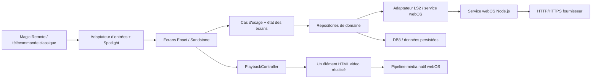

# Spécification technique — lecteur IPTV LG webOS TV 6+

**Version :** 1.0 — **Date :** 28 septembre 2026<br>
**Statut :** spécification de conception, à valider sur téléviseurs réels avant implémentation complète<br>
**Langue de l’interface :** français par défaut, architecture prête pour la localisation

> But : développer un lecteur IPTV webOS clair, utilisable entièrement à la télécommande et réactif sur un téléviseur LG de gamme moyenne. L’application lit uniquement les sources fournies par l’utilisateur. Elle ne fournit ni playlist, ni chaîne, ni compte, ni contenu audiovisuel.

## 0. Décisions recommandées

| Sujet | Décision de référence | Motif |
|---|---|---|
| Type d’application | **Application web empaquetée** (`.ipk`), avec toutes les ressources d’interface dans le paquet | Le premier écran doit s’afficher sans attendre un serveur d’application distant ; LG distingue les apps empaquetées des apps hébergées dont le démarrage dépend du serveur. [S09] |
| Framework UI | **Enact 3.4.9 + Sandstone 1.4.6** pour couvrir webOS TV 6.0 | La matrice LG associe précisément webOS 6.0 à cette version. Enact 4 a abandonné le support de la génération TV 2021, donc ne convient pas à la borne minimale demandée. [S02][S03] |
| Langage | **TypeScript**, compilé en JavaScript pour la TV | Types pour les réponses Xtream/M3U/EPG incohérentes, refactorings plus sûrs ; Enact CLI prend en charge TypeScript. [S04] |
| Navigation télécommande | **`@enact/spotlight`**, intégré à Enact/Sandstone | Gestion de focus 5-way, des conteneurs et du mode pointeur ; les composants Sandstone navigables sont déjà intégrés à Spotlight. [S05][S06] |
| Réseau fournisseur | Petit **service JavaScript webOS** (Node.js compatible 8.12 sur webOS 6) pour les appels API, le téléchargement/parsing M3U et l’EPG | Le service webOS expose le réseau bas niveau. Il permet de traiter la donnée hors du thread d’interface et évite de dépendre du CORS navigateur des portails fournisseurs. [S11][S12][S13] |
| Lecture | Élément **HTML `<video>` natif** et pipeline média webOS, avec URL du flux directement fournie par l’utilisateur | HLS est pris en charge sur l’appareil. Éviter d’abord le démultiplexage HLS en JavaScript, coûteux en CPU/mémoire sur une TV moyenne. [S14] |
| Persistance | **DB8** pour profils, favoris et reprise ; secrets chiffrés, jamais en clair dans `localStorage` | DB8 est le stockage persistant webOS. Le stockage local du webOS TV peut être effacé à la mise à jour d’une application empaquetée. [S17][S19] |

**Choix à valider lors d’un prototype technique obligatoire :** Enact 3.4.9/Sandstone 1.4.6 sur une TV webOS 6 réelle, appels LS2 au service webOS, saisie clavier virtuel, démarrage d’un flux HLS et comportement réel du bouton Retour. Le Simulator webOS 6.0 sert aux vérifications rapides, mais ne remplace pas le test TV pour l’audio/vidéo, les codecs, le DRM ou les performances. [S24]

---

## 1. Objectifs, périmètre et limites

### 1.1 Objectifs produit

1. Présenter quatre entrées principales sur l’accueil : **Live TV**, **VOD**, **Séries** et **Profil**.
2. Ajouter et modifier une source **Xtream-compatible** ou une **URL de playlist M3U** depuis Profil.
3. Parcourir rapidement de gros catalogues au D-pad et à la Magic Remote.
4. Afficher le programme courant et le programme suivant quand un EPG est disponible.
5. Lancer des flux compatibles avec le pipeline média du téléviseur, sans bloquer l’interface.
6. Expliquer les erreurs de manière compréhensible et proposer une action utile : réessayer, changer de source, revenir au catalogue ou corriger le profil.
7. Garder l’écran et la navigation utilisables en cas de perte de réseau, de catalogue vide ou d’indisponibilité EPG.

### 1.2 Inclus dans la V1

- Gestion locale d’un ou plusieurs profils fournisseur, un profil actif à la fois.
- Live TV, catégories, chaînes, favoris et informations EPG courant/suivant.
- VOD, catégories, affiches/posters, fiche courte et lecture.
- Séries, catégories, fiche série, sélection de saison, liste d’épisodes et lecture.
- Lecture HLS et médias HTTP testés sur les appareils ciblés, sous réserve des codecs/conteneurs compatibles.
- États chargement/vide/erreur, reprise manuelle et reconnexion contrôlée.
- Un panneau publicitaire réservé, **vide dans la V1** : pas de SDK publicitaire, de tracking ni de téléchargement d’annonce par défaut.
- Mode pointeur Magic Remote en complément ; aucune fonction essentielle ne dépend du pointeur.

### 1.3 Hors périmètre / non garantis

- Fourniture, découverte, partage ou vente de playlists, identifiants ou chaînes.
- Contournement d’un DRM, d’un abonnement, d’une restriction régionale ou d’un contrôle d’accès.
- Enregistrement vidéo, timeshift/catch-up, contrôle parental, multi-écran, cast, téléchargement ou lecture hors ligne.
- Promesse de prise en charge de tout flux `.ts`, RTSP, RTMP, MPEG-DASH, de tout codec, ou de tous les tags HLS. Les limites webOS et du serveur source s’appliquent. [S14][S15]
- Publicités tierces avant consentement et intégration d’un SDK publicitaire dans cette spécification.

**Conformité :** l’utilisateur doit posséder ou être autorisé à utiliser les sources configurées. Les mentions légales, la politique de confidentialité et toute déclaration demandée par LG doivent être fournies avant distribution.

---

## 2. Recherche : choix du langage, framework et architecture

### 2.1 Contraintes concrètes du runtime

- webOS TV 6.x utilise **Chromium 79**. Les générations suivantes ont des moteurs plus récents, mais le build doit rester compatible avec Chromium 79 si webOS 6 est réellement supporté. Vérifier les propriétés CSS récentes sur ce moteur : ne pas dépendre de `gap` sur un conteneur flex ou de `aspect-ratio` sans fallback, et tester chaque API navigateur au lieu de supposer qu’une transpilation TypeScript suffit. [S01]
- Une application TV webOS est une application web HTML/CSS/JavaScript. Un framework webOS TV n’est pas une application React Native native. [S01]
- Le tableau de compatibilité LG indique **Enact 3.4.9 / Sandstone 1.4.6** pour webOS 6.0. Enact 4 ne prend plus en charge les téléviseurs 2021 ou antérieurs : un build V1 commun webOS 6+ doit donc rester sur la branche Enact 3 validée, ou maintenir des builds distincts après essais. [S02][S03]
- webOS prend en charge deux modes de contrôle Magic Remote : pointeur et navigation 5-way. LG impose de concevoir aussi pour le 5-way ; les flèches et OK doivent suffire à accomplir tout le parcours. [S06]
- La lecture vidéo dépend de l’appareil, du manifeste, du codec, du profil, du débit et du serveur. L’émulateur/simulateur ne reproduit pas fidèlement toutes les capacités média du téléviseur. [S14][S15][S24]

### 2.2 Comparaison des options

| Option | Avantages | Limites pour ce produit | Décision |
|---|---|---|---|
| **Enact 3 + Sandstone + Spotlight** | Écosystème LG, composants 10-foot, focus 5-way et pointeur intégrés, virtualisation de listes, TypeScript, outillage Enact. [S02][S04][S05][S08] | Framework React et rendu DOM : impose de virtualiser et de limiter les mises à jour/effets. Les composants et les versions doivent rester compatibles avec webOS 6. | **Choix V1** : meilleur équilibre entre compatibilité officielle, télécommande et maintenabilité pour l’interface demandée. |
| React + **Norigin Spatial Navigation** | Bonne bibliothèque de navigation spatiale pour React, annoncée pour webOS et d’autres TV web. [S26] | Remplace/duplique une partie de la navigation déjà fournie par Enact/Sandstone ; risque de deux gestionnaires de focus concurrents. | Ne pas ajouter si Spotlight est utilisé. Alternative seulement si l’UI abandonne Enact. |
| **Lightning 3 / Blits** | Framework conçu pour les interfaces TV ; rendu orienté performance et animations sur appareils contraints. [S27] | Modèle de rendu et composants différents, intégration du focus, du pointeur et du pipeline vidéo à prouver sur une TV webOS 6 réelle. Le gain n’est pas garanti sans benchmark sur le matériel visé. | Alternative à prototyper si les mesures Enact échouent, pas une seconde couche à mélanger à la V1. |
| React/DOM sans bibliothèque de focus | Liberté et dépendances potentiellement réduites. | Il faudrait réimplémenter le focus spatial, les frontières, le retour de focus et le scroll par télécommande ; risque élevé de régressions. | Rejeté pour ce besoin où la télécommande est centrale. |

### 2.3 Langage et compilation

- Écrire l’interface et les adaptateurs de données en **TypeScript** ; le code exécuté reste du JavaScript compilé. Activer `strict` dans `tsconfig` et garder les réponses réseau au type `unknown` jusqu’à leur validation runtime : les types TypeScript ne valident pas les données du fournisseur.
- Utiliser la version Enact CLI compatible avec Enact 3.4.9 ; figer toutes les dépendances dans un lockfile et contrôler leurs versions dans CI.
- Compiler pour **Chrome 79** et abaisser la syntaxe de sortie à une cible équivalente à ES2018 ; vérifier/polyfiller individuellement toute API navigateur utilisée.
- Produire un paquet de production statique (bundles locaux, CSS et assets locaux) avec le build production Enact, qui minifie et regroupe le code de l’application. [S10] Pas de `import()`/chargement de chunks à l’exécution dans la V1 empaquetée ; pas de dépendance à un serveur web distant pour dessiner l’interface.
- Éviter les syntaxes et APIs plus récentes sans transpilation/polyfill vérifié sur webOS 6. Ne pas confondre transpilation TypeScript et polyfill des APIs navigateur.

### 2.4 Architecture retenue

Architecture en couches et adaptateurs (ports/adapters), sans serveur cloud obligatoire :



**Responsabilités :**

- `ui/` : écrans et composants Enact/Sandstone ; aucun appel HTTP fournisseur directement dans un composant visuel.
- `domain/` : profils, chaînes, catégories, films, séries, épisodes, programmes EPG, favoris, erreurs normalisées.
- `application/` : cas d’usage (`testerProfil`, `chargerCategories`, `chargerElementsCategorie`, `lireChaine`, `reprendreVOD`, etc.).
- `providers/xtream/` : appels du dialecte Xtream et normalisation des réponses variables.
- `providers/m3u/` : téléchargement et parsing de playlist ; regroupement des entrées et extraction des métadonnées courantes.
- `epg/` : adaptation XMLTV/Xtream, correspondance chaîne-programmes et sélection courant/suivant.
- `platform/webos/` : LS2, cycle de vie, DB8, état réseau, saisie/clavier virtuel, clés système, capacités média.
- `services/provider-service/` : service JS webOS compact pour les requêtes fournisseur et traitements hors UI ; Node.js 8.12.0 est la version documentée pour webOS 6. [S11]
- `player/` : interface `PlayerAdapter` et implémentation `NativeHtmlVideoPlayer`. L’UI du lecteur ne connaît pas les détails du fournisseur.

Le service JS webOS ne doit pas être un serveur de longue durée ni un proxy ouvert. Il exécute les demandes nécessaires, limite les tailles de réponse, ferme les requêtes annulées et n’écrit jamais d’identifiants ou d’URLs authentifiées dans ses logs. LG précise que les services JS utilisent Node.js, donnent accès notamment au réseau bas niveau, et que webOS 6 embarque Node.js 8.12.0. [S11]

### 2.5 Paquet empaqueté, CORS et accès fournisseur

**Problème à traiter dès le prototype :** webOS applique la politique CORS du navigateur. Les portails Xtream et les URLs M3U ne configurent pas tous les en-têtes CORS nécessaires. LG décrit CORS comme une configuration côté serveur ; le forum développeur webOS précise qu’une app empaquetée n’a pas d’origine HTTP classique, ce qui peut rendre les requêtes API navigateur incompatibles avec certains fournisseurs. [S12][S13]

**Décision :** les appels API, le téléchargement M3U et l’EPG passent par le service JS webOS et ses requêtes réseau ; l’interface reçoit des objets JSON normalisés, paginés/chunkés. Le lecteur vidéo reçoit directement l’URL de média et ne lit pas les segments avec du JavaScript. Ne jamais désactiver CORS, ni faire passer les identifiants via un proxy cloud invisible.

Si le service local ne fonctionne pas avec un fournisseur ou est bloqué par une exigence de distribution, solutions de repli explicitement opt-in :

1. demander au fournisseur une API/configuration autorisant l’accès ;
2. proposer un pont local que l’utilisateur héberge et configure lui-même ;
3. éventuellement proposer un service relais documenté, avec consentement clair, politique de confidentialité, chiffrement et divulgation des données transmises.

Un relais distant n’est **pas** le comportement par défaut.

---

## 3. Parcours et exigences fonctionnelles

### 3.1 Accueil — quatre choix primaires

L’accueil comprend quatre grandes cartes/boutons, sans menu d’icônes ambigu :

1. **Live TV**
2. **VOD**
3. **Séries**
4. **Profil**

Chaque carte a un intitulé lisible, une icône simple, un état de focus très visible et un aperçu visuel discret. Le profil actif peut être indiqué dans l’en-tête. Si aucun profil n’est configuré, les sections de contenu expliquent qu’une source est nécessaire et le focus peut aller directement vers **Profil**, sans supprimer les quatre entrées.

### 3.2 Live TV

Disposition cible en 16:9 :

```text
┌──────────────────┬────────────────────────┬────────────────────────────────┐
│ Catégories        │ Chaînes de la catégorie│ EPG de la chaîne sélectionnée  │
│ panneau gauche    │ panneau central        ├────────────────────────────────┤
│                  │                         │ Espace publicité réservé, vide │
└──────────────────┴────────────────────────┴────────────────────────────────┘
```

- Le panneau catégories et le panneau chaînes sont adjacents, séparés par une bordure ou un faible espace ; ils ne doivent pas paraître comme deux pages distinctes.
- Le panneau de droite est divisé verticalement : EPG en haut, emplacement publicitaire vide en bas.
- La sélection d’une chaîne met à jour son nom, logo disponible, programme courant, horaires, progression, description courte et programme suivant. **La sélection seule ne lance pas le flux** ; OK ouvre le lecteur.
- Le panneau EPG fonctionne même si le flux n’est pas lancé. Un EPG absent ou non apparié donne un état « Guide non disponible » sans bloquer les chaînes.
- L’emplacement publicitaire reste vide/neutre en V1 ; il ne doit pas recevoir d’appels réseau ou prendre le focus. Une future annonce ne devra jamais recouvrir la navigation ni retarder la lecture.
- États à concevoir : aucune catégorie, aucune chaîne, chargement, favoris vides, EPG absent, réseau indisponible, erreur fournisseur, source non compatible.
- Actions supplémentaires V1 : ajouter/retirer des favoris, rafraîchir la source depuis Profil et rechercher une chaîne avec clavier virtuel si cette option passe les tests d’ergonomie.

### 3.3 VOD

- Catégories à gauche ; à droite, la plus grande zone d’écran est une grille virtualisée de films.
- Poster de taille modérée, jamais une affiche plein écran dans la grille. Afficher le titre et, si disponibles, année/durée/notation ; les données manquantes ne doivent pas créer de trous visuels.
- La grille doit rester parcourable si les posters sont absents ou lents : placeholder immédiat, chargement différé, image de repli en cas d’échec.
- OK sur un poster ouvre une fiche (titre, affiche, résumé, durée, année, bouton Lire, favori). OK sur **Lire** ouvre le lecteur.
- Après retour du lecteur, restaurer catégorie, index sélectionné, scroll et focus.

### 3.4 Séries

- Catégories à gauche ; grille de séries virtualisée dans le panneau principal.
- OK sur une série ouvre une fiche de série (nom, visuel, synopsis si disponible) et le choix de saison.
- Après choix de saison, afficher les épisodes ; chaque ligne/card indique numéro, titre, durée ou résumé si présents.
- OK sur un épisode ouvre le lecteur. À la fermeture, restaurer la série, la saison, l’épisode sélectionné et la position de scroll.
- Xtream-compatible fournit normalement des objets de séries/saisons/épisodes, mais les réponses et noms de champs varient. L’adaptateur doit vérifier les données et afficher les champs présents.
- Une playlist M3U ordinaire n’a pas une structure série/saison/épisode universelle. Avec M3U, regrouper uniquement lorsque les métadonnées ou noms permettent une inférence raisonnable (ex. `S02E04`) ; sinon proposer une liste d’éléments plats/catégorisés, ne pas inventer une saison ou un titre d’épisode.

### 3.5 Profil et sources

Le panneau Profil permet de créer, tester, modifier, choisir comme actif, actualiser et supprimer une source. Au moins deux types :

**Xtream-compatible**
- Nom de profil facultatif.
- URL de base (schéma, hôte, port et éventuel chemin de base).
- Nom d’utilisateur.
- Mot de passe, masqué par défaut.
- Format live : Auto / HLS / transport stream lorsque le fournisseur propose ces variantes ; une alternative ne doit être essayée que si connue et compatible.
- URL EPG facultative si elle diffère de la source par défaut.
- Bouton **Tester et enregistrer** : valider l’URL, effectuer une requête d’identification/categories limitée, présenter le résultat et les erreurs sans afficher le mot de passe.

**URL M3U**
- Nom de profil facultatif.
- URL M3U/M3U8 complète (saisie de type URL, support HTTPS prioritaire).
- URL EPG XMLTV facultative ; sinon utiliser l’URL `url-tvg`/`x-tvg-url` détectée si elle existe.
- Boutons **Tester**, **Importer/actualiser** et **Enregistrer**. Afficher le nombre d’entrées/groupes trouvés et les avertissements de parsing.

Les champs URL et mot de passe doivent s’utiliser avec le clavier virtuel LG. Utiliser les attributs `type="url"` et `type="password"` ; garder le champ dans la zone visible lorsque le clavier apparaît. Les événements clavier ordinaires ne sont pas une source fiable pour lire les caractères produits par le clavier virtuel : écouter la valeur du champ (`input`/`change`) et traiter `keyboardStateChange` sans annuler une saisie vocale. [S22]

---

## 4. Spécification détaillée de la télécommande

### 4.1 Principes non négociables

- **100 % des opérations courantes doivent être possibles au D-pad et à OK**, sans pointeur ni clavier externe. [S06]
- Le focus ne doit jamais disparaître, être invisible ou sauter vers le haut de l’écran sans raison.
- Chaque écran définit explicitement les destinations gauche/droite/haut/bas aux frontières entre panneaux. Ne pas laisser l’algorithme spatial choisir une destination ambiguë.
- Garder l’état de focus et le scroll par écran. À l’ouverture d’une boîte modale, mémoriser le focus d’origine ; au retour, le restaurer.
- Magic Remote pointeur et roue restent pris en charge en amélioration progressive. Une action au pointeur doit produire le même état de sélection que l’action OK.
- Réserver `@enact/spotlight` comme **seul** gestionnaire spatial V1. Utiliser ses conteneurs, `Spottable`/composants Sandstone et les hooks de direction pour les transitions déterministes. Spotlight sait basculer entre mode 5-way et pointeur et calcule le focus à partir de la géométrie DOM ; les changements dynamiques nécessitent une gestion correcte du cache/focus. [S05]

### 4.2 Codes et actions

Codes de référence publiés pour Magic Remote webOS. Vérifier également `event.key` quand disponible, mais conserver la table de codes webOS testée sur appareil. [S06]

| Touche | Code | Action proposée |
|---|---:|---|
| Gauche / Haut / Droite / Bas | 37 / 38 / 39 / 40 | Déplacer le focus ; dans le lecteur, comportement contextuel décrit ci-dessous. |
| OK / Entrée | 13 | Sélectionner, ouvrir, lire ou valider l’action du contrôle focalisé. |
| Retour / Back | 461 | Revenir à l’étape précédente selon la pile d’historique. À la racine, laisser le comportement standard webOS 6+ ou demander confirmation sans empêcher la sortie système. |
| Rouge / Vert / Jaune / Bleu | 403 / 404 / 405 / 406 | Facultatives ; n’assigner qu’une action annoncée visuellement et testée. Ne jamais rendre une fonction essentielle dépendante de leur présence. |
| Lecture / Pause | 415 / 19 | Contrôle de lecture si la télécommande conventionnelle et l’événement sont disponibles. |
| Avance / Retour rapide / Stop | 417 / 412 / 413 | Stop : quitter le lecteur ; avance/retour : saut VOD borné seulement si `seekable` le permet. Ne pas promettre l’accélération média continue. |

Les commandes Power, Home, volume, mute et les actions réservées au système ne doivent pas être interceptées. Les numéros ne sont pas requis : certaines Magic Remote n’ont pas de touches numériques ; le clavier virtuel est l’alternative.

### 4.3 Carte de focus par écran

| Écran | Règles de focus |
|---|---|
| Accueil | Grille 2 × 2 ou rangée de quatre cartes selon résolution ; déplacement naturel, focus initial sur le profil actif ou Live si configuré. |
| Live catégories | Haut/bas dans les catégories ; droite vers la chaîne sélectionnée ; gauche ne quitte pas la page. |
| Live chaînes | Haut/bas dans la liste virtualisée ; gauche vers catégorie active ; droite vers actions EPG disponibles, sinon rester dans le panneau. L’espace publicitaire vide n’est pas focalisable. |
| VOD / Séries | Haut/bas/gauche/droite dans la grille ; gauche vers catégories au bord gauche ; entrée dans une fiche par OK ; le retour restaure l’élément. |
| Fiche série | Focus initial sur saisons ; droite vers épisodes ; haut/bas dans la colonne ; OK confirme la saison/l’épisode. |
| Fiche VOD | Ordre : Lire, Favori, Retour/fermer ; jamais de focus derrière la modalité. |
| Profil | Formulaire vertical ; OK active clavier virtuel ; le curseur système peut apparaître, mais les autres champs et actions restent D-pad accessibles. |
| Dialogues | Focus piégé dans le dialogue, bouton principal mis en évidence ; Retour ferme ou annule selon le contexte, aucune suppression directe. |
| Lecteur | La vidéo ne capte pas le focus. Le panneau de commandes reçoit le focus uniquement quand l’overlay est affiché. Retour quitte le lecteur ; gauche/droite naviguent/seeks selon la règle ci-dessous. |

### 4.4 Répétition, pressions longues et protection contre les doubles actions

- Traiter `keydown` et `keyup` ; utiliser `event.repeat`/la répétition observée, sans attendre que la touche soit relâchée pour afficher le premier mouvement.
- Le premier D-pad déplace le focus immédiatement. Répétitions bornées par un throttle réglable (cible de départ : 80–120 ms), avec accélération de défilement seulement après un maintien mesuré ; le focus doit s’arrêter sur l’élément final, sans sauter aléatoirement.
- Dédupliquer OK sur un délai court (cible initiale : 250–350 ms) et ignorer une double validation provoquée par la répétition d’une touche tenue.
- Sur une saisie active, ne pas détourner les flèches/OK du clavier virtuel ou du champ. Les raccourcis globaux sont désactivés jusqu’à la fermeture effective du clavier.
- N’appeler `preventDefault()`/`stopPropagation()` que pour une touche effectivement prise en charge par l’application.

### 4.5 Retour, routes et Magic Remote

- Utiliser la pile History webOS : un état par écran/fiche/lecteur, `pushState()` à l’entrée et `popstate` au Retour. Ne pas créer un historique par mouvement de focus.
- Garder le comportement Back standard autant que possible ; ne définir `disableBackHistoryAPI` à `true` que si un test démontre que l’application doit prendre entièrement la main, puis appeler la méthode de retour plateforme dans le cas prévu. LG documente les deux modes et le code Back 461. [S07]
- Laisser le système gérer Back à la racine conformément à webOS 6+ ; éviter une imitation fragile de la sortie système.
- Écouter la visibilité du pointeur et les événements de vie ; quand le système recouvre l’app (Home/Settings), l’app ne doit pas croire que le pointeur est encore disponible. [S06][S16]

### 4.6 Comportement spécifique du lecteur

- **Live** : OK démarre/relance ; haut/bas peuvent zapper chaîne précédente/suivante lorsque les commandes sont affichées ; gauche/droite n’essaient pas de seek s’il n’existe pas de fenêtre live/DVR déclarée.
- **VOD / épisode** : gauche/droite font un saut de 10 secondes si le média est seekable ; un maintien répète les sauts, sans `playbackRate` autre que 1.0.
- La barre de commandes disparaît après temporisation si le focus n’est pas sur un contrôle. Une touche D-pad/OK la réaffiche.
- Afficher la règle à l’écran la première fois ; éviter des raccourcis invisibles.
- Le Retour à un catalogue conserve la position de liste, le profil, la catégorie et l’élément sélectionné.

---

## 5. Sources, formats et normalisation des données

### 5.1 Adaptateurs fournisseur

Xtream-compatible et M3U ne doivent pas être codés en dur dans les vues. Chaque profil expose une interface commune :

```text
ProviderAdapter
  testConnection(profile)
  getCategories(contentType)
  getItems(contentType, categoryId, cursor?)
  getDetails(contentType, itemId)
  getEpg(channelId, timeRange)
  resolveStream(item, requestedFormat)
  refresh(profile)
```

Les actions et champs Xtream sont une convention de facto, non une API unique garantie. Tester la réponse réelle, gérer identifiants en nombre ou chaîne, champs manquants, versions de noms (`series_id`, par exemple) et variantes EPG ; ne jamais supposer que toute réponse 200 est un JSON valide.

**Appels courants à encapsuler dans l’adaptateur Xtream-compatible :** authentification `player_api.php`, catégories live/VOD/séries, listes filtrées par `category_id`, détail VOD, détail série avec saisons/épisodes, EPG court ou XMLTV. Les URL de flux sont construites séparément à partir du format/identifiant communiqué par le fournisseur, sans stocker la chaîne d’URL dans les logs.

### 5.2 Import M3U

Le parser M3U doit prendre en charge les conventions habituelles, sans prétendre qu’elles forment un schéma IPTV entièrement standard :

- `#EXTM3U`, `#EXTINF`, commentaires, lignes vides, CRLF/LF, BOM UTF-8.
- Attributs fréquents `tvg-id`, `tvg-name`, `tvg-logo`, `group-title` et numéro de chaîne.
- Valeurs citées pouvant contenir des espaces ou virgules : séparer le titre au bon séparateur, pas à chaque virgule.
- URL média sur la ligne suivante ; tolérer certains commentaires/interlignes intermédiaires ; ignorer proprement les entrées incomplètes et compter les avertissements.
- `url-tvg`/`x-tvg-url` comme EPG par défaut ; permettre une URL EPG distincte saisie dans Profil.
- Pas de `innerHTML` : les noms provenant de playlist/provider restent du texte, échappé comme contenu.
- N’accepter que les schémas de lecture approuvés et testés (`http`/`https` en V1). Signaler les schémas/protocoles non pris en charge au lieu de tenter de les exécuter.
- Pour l’import, borner les redirections (maximum initial de 5), revalider le schéma et l’hôte à chaque saut, ne jamais transférer `Authorization`/cookies à un autre hôte et demander confirmation avant un downgrade HTTPS→HTTP. Refuser loopback par défaut ; les serveurs LAN privés peuvent être autorisés explicitement par l’utilisateur, car ils sont un cas d’usage possible.
- Détecter les doublons par identifiant/URL de source ; ne pas supprimer deux chaînes distinctes au seul motif qu’elles ont le même nom.
- Ne pas télécharger simultanément toutes les images. Charger les logos/posters à la demande et limiter l’activité réseau.

Pour préserver la fluidité, le service doit limiter la taille importée, contrôler les redirections et envoyer les résultats par pages/chunks à l’application ; une playlist géante ne doit pas produire une seule grosse réponse LS2 ni monopoliser l’interface. Valeurs initiales à valider sur TV : avertissement au-delà de 10 Mio ou 20 000 entrées ; plafond de sécurité initial de 25 Mio ou 50 000 entrées (le premier plafond atteint gagne) ; page de 100–250 éléments selon taille des champs. Mesurer la taille réellement reçue/après décompression au fil du flux, sans faire confiance au seul `Content-Length`. En cas de dépassement, conserver le dernier import valide et proposer de réduire la playlist côté fournisseur.

**Classification M3U :** durée live inconnue et groupe/type explicite pour les chaînes ; durée finie ou groupe `film`/`vod`/`movie` pour VOD. Détection série uniquement à partir de champs/noms explicites (ex. SxxExx) et avec repli « liste non structurée ». Un profil Xtream-compatible est la source de référence pour une navigation fiable saisons/épisodes.

### 5.3 Modèle de domaine minimal

| Objet | Champs normalisés (exemples) |
|---|---|
| `Profile` | `id`, `name`, `providerType`, `baseUrl`, `username` si nécessaire, `secretRef`, `epgUrl?`, `preferredLiveFormat`, `lastSyncAt`, `status` |
| `Category` | `id`, `profileId`, `contentType`, `name`, `sortOrder?` |
| `Channel` | `id`, `categoryId`, `name`, `logoUrl?`, `epgId?`, `streamRef`, `favorite`, `sourceOrder` |
| `Movie` | `id`, `categoryId`, `title`, `posterUrl?`, `year?`, `duration?`, `plot?`, `rating?`, `streamRef` |
| `Series` | `id`, `categoryId`, `title`, `posterUrl?`, `plot?`, `seasons[]` ou référence de détail |
| `Episode` | `id`, `seriesId`, `seasonNumber?`, `episodeNumber?`, `title`, `duration?`, `plot?`, `streamRef` |
| `Program` | `epgChannelId`, `startUtc`, `endUtc?`, `title`, `description?`, `category?`, `imageUrl?` |
| `PlaybackPosition` | `profileId`, `contentId`, `positionSeconds`, `durationSeconds?`, `updatedAt`, `completed` |

`streamRef` est une référence logique ; l’URL de lecture authentifiée est résolue au dernier moment et conservée seulement en mémoire aussi longtemps que nécessaire.

### 5.4 EPG

- Priorité de correspondance : identifiant EPG exact (`tvg-id`/id de chaîne) ; puis identifiant que renvoie l’API ; enfin appariement par nom normalisé, seulement comme suggestion.
- XMLTV stocke des chaînes et des programmes avec identifiants et horaires début/fin ; convertir systématiquement les dates en UTC puis afficher dans le fuseau de la TV/appareil. [S25]
- Conserver uniquement la fenêtre EPG utile (ex. maintenant ± 24–48 h) et les métadonnées nécessaires ; ne jamais charger plusieurs jours d’EPG dans le DOM.
- Un EPG volumineux est traité dans le service/par lots ou dans un Worker testé sur webOS 6 ; parser `description`/CDATA, encodages et fuseaux invalides sans faire échouer les chaînes. Plafond initial indicatif de 50 Mio décompressés, comptés en streaming ; au-delà, privilégier l’EPG court par chaîne du fournisseur ou expliquer que le guide complet est trop volumineux.
- Charger l’EPG en arrière-plan après les premières catégories ; mettre à jour l’EPG à la sélection de chaîne avec debounce (environ 150–250 ms) ; ne pas requêter un EPG par touche répétée.
- Si le guide est vide, trop ancien, non apparié ou invalide, afficher une indication discrète ; la lecture live reste indépendante.
- Ne pas recharger la totalité d’un XMLTV à chaque navigation de chaîne ; cache borné et rafraîchissement contrôlé (valeur de départ 6–12 h, ajustable par profil).

---

## 6. Lecture média et états du lecteur

### 6.1 Stratégie de lecture

- Utiliser un **seul élément `<video>` réutilisable** ; éviter plusieurs décodeurs actifs lors des changements de chaîne.
- À chaque nouveau média : annuler les listeners/timers de la session précédente, arrêter la vidéo précédente, vider sa source proprement, affecter la nouvelle URL, appeler `load()` puis `play()` après l’action OK. Observer le rejet de `play()` : si le moteur exige une activation utilisateur directe, afficher « Appuyez sur OK pour démarrer » et retenter depuis cette nouvelle pression, sans classer cela comme un échec de codec.
- HLS : privilégier le HLS natif webOS. La spécification LG déclare HLS pris en charge sur le téléviseur, mais documente également des tags HLS absents/partiels, l’absence d’avance/retour rapide continu et la prise en charge du seek selon le média. [S14]
- Supports de base à valider sur téléviseurs : flux HLS délivrant un codec/conteneur compatible ; sources HTTP/HTTPS directes si format vidéo/audio officiellement supporté. Pour webOS 6.0, LG liste notamment H.264 et HEVC avec limites selon modèle/résolution, AAC et plusieurs conteneurs ; GMC/Qpel et certains profils ne sont pas pris en charge. Ne pas annoncer un support universel sur la seule base de l’extension. [S15]
- Limite d’interface : `<video>` natif ne permet pas de garantir l’envoi d’en-têtes d’authentification arbitraires. Les fournisseurs qui exigent un header propriétaire doivent être déclarés non supportés tant qu’un prototype TV ne valide pas une solution. Les tokens dans une URL de flux restent secrets et ne doivent jamais apparaître dans les logs.
- Ne pas inclure HLS.js dans le chemin par défaut : il transfère au navigateur la segmentation/buffer en JavaScript et augmente les coûts CPU/mémoire. La V1 s’appuie sur le pipeline média natif ; toute bibliothèque MSE (par ex. Shaka) est une évolution après mesure/prototype ciblé.
- L’usage de DASH/MSE/EME ou d’un DRM doit faire l’objet d’une décision produit, d’une validation des droits/licences et d’essais appareil par appareil. La matrice LG webOS 6 décrit certaines combinaisons HLS-AES128 et MSE/EME-PlayReady/Widevine ; cela ne signifie pas que tous les flux DASH/DRM fournisseurs fonctionnent. [S14]
- Si le manifeste indique des tags non pris en charge, segments A/V incompatibles, un codec non pris en charge ou un certificat TLS non reconnu, afficher une erreur « source non compatible ou inaccessible » et diagnostic non sensible. Ne pas boucler indéfiniment.

### 6.2 Machine d’état

```text
IDLE → PREPARING → BUFFERING → PLAYING
                     ↘ ERROR     ↗
PLAYING ↔ BUFFERING
PLAYING/PAUSED → STOPPING → IDLE
```

- **PREPARING** : valider référence, URL et profil ; arrêter ancien média ; afficher titre et affiche/logo.
- **BUFFERING** : spinner discret, commandes déjà accessibles, timer de démarrage.
- **PLAYING** : masquer le spinner ; afficher un toast temporaire au changement live.
- **PAUSED** : afficher les commandes ; état réservé principalement à VOD et commandes télécommande compatibles.
- **ERROR** : message, cause probable, actions Réessayer/Retour/Autre chaîne ; préserver l’accès Back.
- **STOPPING** : pause, retirer la source, appeler `load()` pour libérer le pipeline ; ne garder aucune session de lecture inutile.

Événements à observer : `loadstart`, `loadedmetadata`, `canplay`, `playing`, `waiting`, `stalled`, `timeupdate`, `durationchange`, `seeking`, `seeked`, `pause`, `ended`, `abort`, `emptied`, `error`. Gérer proprement le démontage de l’écran, un changement de profil et le passage de l’application en arrière-plan.

### 6.3 Contrôles VOD et reprise

- Pause/reprise, seek uniquement dans `video.seekable` et à une vitesse normale ; aucune promesse d’avance accélérée ou de vitesse variable.
- Afficher une barre de progression seulement si la durée est finie et exploitable ; ne pas afficher `NaN`/durée infinie.
- Enregistrer la position périodiquement à faible fréquence (valeur de départ 30 s) et à pause/fin, pas à chaque `timeupdate`.
- À la reprise : proposer **Reprendre** ou **Depuis le début** ; marquer terminé selon une règle configurable (par ex. position > 95 %), puis autoriser à rejouer.
- Sous-titres/audio : afficher uniquement les pistes réellement signalées et testées par le média natif ; ne pas afficher un sélecteur vide.

### 6.4 Limites de commandes à expliquer à l’utilisateur

LG documente le seek et le live seek (webOS 3+), mais indique que l’avance rapide et le retour rapide continus et les vitesses autres que 1.0 ne sont pas pris en charge par le lecteur média. Les touches de saut VOD doivent donc effectuer une recherche temporelle bornée, pas promettre une lecture accélérée. [S14]

---

## 7. Gestion des erreurs, réseau et reprise

### 7.1 Modèle d’erreur commun

Chaque couche renvoie une erreur structurée, sans texte sensible :

```text
AppError {
  domain: network | cors | auth | provider | playlist | epg |
          playback | storage | platform | unknown
  code: string
  userMessageKey: string
  retryable: boolean
  operationId: string
  httpStatus?: number
  providerCode?: string
  timestamp: number
  safeTechnicalHint?: string
}
```

Ne pas inclure URL complète, paramètres authentifiés, nom d’utilisateur, mot de passe, token ou contenu de playlist dans la console, les rapports de crash ou les dialogues d’erreur.

### 7.2 Matrice d’erreurs et d’actions

| Cas | Détection/limite | Message/action côté TV |
|---|---|---|
| TV hors ligne / Wi-Fi perdu | Statut système si disponible + requête test réelle ; `navigator.onLine` n’est qu’un indice | « Le téléviseur n’est pas connecté à Internet. » Réessayer, ouvrir Profil ou continuer sur catalogue local disponible. |
| DNS, hôte introuvable, délai dépassé | Timeout réseau ; distinguer l’erreur de connexion d’un JSON invalide | « Le serveur ne répond pas. Vérifiez l’adresse et le réseau. » Réessayer ou modifier le profil. |
| TLS/certificat/horloge/certificat non fiable | Échec de connexion sécurisée ; ne jamais désactiver la validation TLS | « Connexion sécurisée impossible. Vérifiez l’adresse, l’horloge TV ou le certificat du serveur. » |
| CORS API web | En TV, appels fournisseur par le service JS ; en mode navigateur dev, reconnaître `TypeError`/erreur CORS sans la confondre avec un 404 | « Cette source n’autorise pas l’accès depuis le navigateur. » En TV, vérifier le service fournisseur ; en dev, utiliser un mock ou un relais local explicite. |
| HTTP 401/403 fournisseur | Lire le statut si la réponse API l’expose ; la lecture native peut ne pas exposer le statut HTTP à JS | « Identifiants invalides, abonnement expiré ou accès refusé. » Modifier/tester le profil. Ne pas prétendre connaître la raison exacte si la TV ne donne que `MediaError`. |
| HTTP 404/base URL incorrecte | Réponse API disponible | Vérifier URL, port, chemin de base et type d’API. Bouton Modifier le profil. |
| HTTP 429/rate limit | Statut et `Retry-After` si fourni | Suspendre les requêtes, réessayer après le délai ; ne pas marteler le fournisseur. |
| HTTP 5xx fournisseur | Réponse API | « Le fournisseur rencontre un problème. » Réessai borné et manuel. |
| HTML/login inattendu à la place JSON | Content-type ou parsing/schema invalide | « Réponse fournisseur inattendue. Vérifiez l’URL ou le portail. » Aucun crash de l’écran. |
| Profil accepté mais 0 catégorie/chaîne | Liste vide valide séparée d’une erreur | « Aucune chaîne dans cette source » + actualiser/changer de profil. |
| M3U illisible, vide ou mal formée | Header absent, nombre d’entrées invalides, plafond atteint | Compteur d’éléments importés + avertissement et action « Corriger l’URL / Réessayer ». Garder l’ancien catalogue en cache tant que le nouvel import n’est pas validé. |
| XMLTV vide, XML mal formé, fuseaux/IDs inconnus | Parseur EPG indépendant | « Guide EPG indisponible » ; les chaînes restent utilisables. |
| Logo/poster 404 ou lent | `onError`, délai, chargement différé | Placeholder stable, aucun blocage catalogue ni déplacement de focus. |
| URL source expirée/flux 403 | `MediaError`, test de la source quand possible ; le statut HTTP exact n’est pas toujours disponible au `<video>` | « Flux inaccessible — l’adresse a peut-être expiré ou l’accès est refusé. » Réessayer, autre chaîne ou modifier source. |
| Source/formats/codecs non pris en charge | `MediaError` code 3/4, type média inconnu, manifeste incompatible | « Format non pris en charge par ce téléviseur ou cette source. » Retour au catalogue et diagnostic anonymisé. |
| Lecture refusée avant démarrage | Rejet de `play()` (ex. politique/activation utilisateur), sans `MediaError` exploitable | « Appuyez sur OK pour démarrer la lecture. » Relancer sur une pression explicite et garder Retour accessible. |
| `waiting`/`stalled` trop long | Seuil de départ : 10–15 s sans avancée, ajustable au HLS fournisseur | Distinguer « Mise en mémoire tampon » et « Lecture interrompue ». Réessayer ou revenir au direct ; pas de spinner infini. |
| DB8 plein/indisponible | Erreur LS2 / quota | Préserver l’interface, expliquer que favoris/profil ne peuvent être enregistrés, proposer libérer cache. Pas de perte silencieuse. |
| Retour, changement de profil ou relance en cours de requête | Annulation par `operationId`/token de session | Annuler la requête et empêcher toute réponse ancienne de remplacer le nouvel écran ou le nouveau flux. |
| Application masquée/arrière-plan | `visibilitychange`, `webOSRelaunch` | Arrêter chargements de posters/EPG non nécessaires ; pause/arrêt média selon la politique ; restaurer l’état sûr au retour. [S16] |

**Important :** les erreurs `HTMLMediaElement` ne donnent pas toujours le code HTTP précis du segment/manifeste. Utiliser les codes média (abandon, réseau, décodage, source non prise en charge), le statut réseau observable et des tests ciblés ; ne pas déduire à tort qu’un code 4 signifie mot de passe erroné. [S14]

### 7.3 Timeouts, concurrence et réessais

Valeurs de départ à mesurer et à rendre configurables :

- Appels API catégories/détails : délai connexion 8 s ; délai total 15 s.
- Import M3U/EPG : délai total supérieur, plafond de taille et progression ; annulation possible par Retour/changement de profil.
- Au plus 4 requêtes de métadonnées fournisseur simultanées ; pas de chargement global de toutes les images.
- GET idempotent : au plus 2 réessais automatiques sur timeout/erreur réseau/5xx, backoff avec jitter (ex. 1 s puis 3 s). Pas de retry auto sur credentials incorrects, CORS, parsing ou refus 403/404.
- HTTP 429 : respecter `Retry-After`, sinon temporisation plus longue, jamais boucle serrée.
- Démarrage vidéo : indicateur immédiat ; timeout utilisateur initial 20 s à calibrer sur réseau de référence ; un clic Réessayer lance une nouvelle session et annule l’ancienne.
- Flux live : au plus 3 reconnexions automatiques dans une fenêtre de 2 minutes et uniquement sur incident réseau récupérable. Pas de zapping silencieux vers une autre chaîne.
- La connexion TV est un état indicatif : effectuer une requête réelle à la source au besoin. `online` ne prouve pas que le DNS, le portail ou le flux est disponible.

---

## 8. Données persistantes, secrets et confidentialité

### 8.1 Persistance

- Utiliser DB8, avec kinds versionnés et validation du schéma, pour profils, préférences, favoris, historique et reprise ; DB8 est app-aware et fournit pagination. [S17]
- Marquer les données privées qui ne doivent plus exister après désinstallation avec l’option DB8 privée lorsque approprié ; vérifier les comportements mise à jour/désinstallation lors du test appareil. [S17]
- Ne pas sauvegarder le catalogue fournisseur complet à chaque ouverture. Garder en mémoire l’écran courant ; cache borné des catégories, premiers lots et EPG proche. Le cache est remplaçable et peut être purgé.
- `localStorage` n’est réservé qu’à des réglages non sensibles et non critiques. LG indique que le stockage local d’une application empaquetée peut être supprimé lors d’une mise à jour ou suppression ; prévoir une migration et ne pas y laisser les seules copies des favoris/profils. [S19]

### 8.2 Stockage des secrets

Les URLs M3U peuvent elles-mêmes contenir un utilisateur, un mot de passe ou un token ; les traiter comme des secrets. Le mot de passe Xtream ne doit pas être inclus dans le nom de profil ou les logs.

- Profil DB8 : conserver une référence de secret et un blob chiffré, pas le mot de passe en clair.
- webOS 24+ : prendre en charge Keymanager3 si les opérations nécessaires sont disponibles ; LG indique que l’API fondée sur le TEE est utilisable à partir de webOS TV 24. Ne pas l’exiger sur webOS 6–23. [S18]
- webOS 6–23 : demander une passphrase de déverrouillage à l’utilisateur. Baseline : dériver une clé 256 bits avec PBKDF2-HMAC-SHA-256 à 600 000 itérations — valeur conservatrice retenue ici et recommandée par l’OWASP lorsque la conformité FIPS 140 est exigée —, avec un sel aléatoire de 16 octets ; chiffrer ensuite en AES-256-GCM avec nonce unique aléatoire de 12 octets et tag d’authentification de 16 octets. Stocker le format/version, les paramètres KDF, sel, nonce, ciphertext et tag ; ne jamais réutiliser un nonce avec une même clé. [S30][S31] Faire la dérivation de façon asynchrone dans le service et mesurer le temps sur le téléviseur le plus faible ; si le compromis sécurité/temps n’est pas acceptable, demander le secret à chaque session plutôt que de baisser silencieusement le coût. Ne jamais coder une clé secrète dans l’application ni stocker la passphrase. Si l’utilisateur refuse le chiffrement persistant, redemander le secret lorsque nécessaire.
- Déchiffrer uniquement pour la durée d’une opération et effacer les références en mémoire au changement de profil/fermeture. Les chemins HTTP non chiffrés doivent déclencher un avertissement visible avant enregistrement/usage.
- Ne jamais désactiver le contrôle TLS, même pour un certificat invalide.

Le détail d’accès à Keymanager3, la dérivation et le comportement de restauration doit être prototypé sur les versions 6, 22, 24 et supérieures avant de figer l’expérience de connexion. LG demande le chiffrement des informations sensibles et l’absence de secrets dans les logs. [S18][S20]

### 8.3 Confidentialité

- Aucun compte d’application, analytics, télémétrie ou identifiant TV ne sont nécessaires à la V1.
- Pas d’envoi d’identifiants, d’historique, d’IP ou de titre regardé à un serveur du développeur.
- Logs de diagnostic locaux sans mots de passe, URLs d’accès, tokens, EPG complet ou historique nominatif.
- Prévoir dans l’application : suppression d’un profil et de ses caches/favoris, effacement des données, page de confidentialité en langage simple.
- Tout SDK futur (publicité/analytics) nécessite examen de ses accès, divulgation et consentement lorsque requis ; vérifier la politique LG mise à jour avant intégration. [S20]

---

## 9. UI, identité visuelle et performance

### 9.1 Direction UI

- Interface « salon » : lisible à distance, peu de texte secondaire, hiérarchie plate et panneaux clairement nommés. LG recommande la simplicité, peu d’idées simultanées, de grands éléments et un usage mesuré du mouvement. [S23]
- Fond sombre bleu/ardoise, surfaces légèrement différenciées, accent turquoise/cyan ou ambre réservé au focus/état actif. Contraste élevé, libellés explicites, icônes toujours accompagnées d’un nom lorsque leur sens n’est pas évident.
- Typographie TV : titres généreux, noms de chaînes/posters lisibles, texte EPG avec lignes limitées et « Lire la suite » focalisable.
- Effets élégants mais économiques : légère mise à l’échelle du focus, contour lumineux, transitions fondues ou `transform`/`opacity` de 150–220 ms. Pas de vidéo d’arrière-plan, filtres flous continus, grosses ombres sur chaque carte ni animation déclenchée par chaque rerender.
- Respecter une zone sûre d’écran (5 % environ comme cible initiale) et vérifier 1280×720, 1920×1080 et 4K ; éviter qu’un focus en bord de liste soit coupé.
- Maintenir une grille de 8 px logique (adaptée à la densité TV), espacement constant et cartes assez grandes pour cliquer au pointeur.
- Affiche/poster : image adaptée à la taille de carte, lazy-load, ratio stable et fallback ; aucune grande image inutile décodée à l’ouverture du catalogue.

### 9.2 Budgets de performance projet

Ces nombres sont des **objectifs internes à valider**, pas des performances garanties par LG. Le modèle de référence est la TV webOS 6 de gamme la plus modeste disponible à l’équipe, raccordée à un réseau de test stable.

| Mesure | Objectif V1 |
|---|---|
| Accueil froid, hors réseau | visible rapidement avec ressources empaquetées ; cible < 3 s pour l’écran interactif au p95 sur l’appareil de référence. |
| D-pad → focus visible | cible p95 ≤ 150 ms ; aucune navigation qui attend le réseau ou le chargement d’une image. |
| Transition locale entre écrans | cible p95 ≤ 300 ms, sans recharger l’app entière. |
| Sélection d’une catégorie déjà en cache | cible ≤ 250 ms avant feedback ; le réseau remplit ensuite le contenu. |
| VOD/grilles/catalogues longs | virtualisation Sandstone ; ne monter que les éléments visibles et un petit tampon ; retenir le focus sans reconstruire tout le catalogue. [S08] |
| Lecture | afficher immédiatement l’état de préparation ; afficher l’image/nom pendant l’attente ; mesurer séparément délai fournisseur et temps jusqu’à première image. |
| Images | jamais attendre logo/poster pour rendre l’élément, la liste ou le focus. |
| Session longue | scénario soak de 30 min et au moins 100 changements de chaîne ; aucune croissance mémoire monotone, perte durable de réactivité, écran noir ou crash. Mesurer CPU/mémoire sur TV réelle avec les outils LG. [S21] |
| Bundle | build production minifié, imports limités et assets locaux ; fixer un budget de bundle en CI après première mesure réelle plutôt que d’ajouter des dépendances sans contrôle. |

### 9.3 Techniques obligatoires

- Utiliser Sandstone `VirtualList`/`VirtualGridList` pour les longues listes. Définir `itemSize`, `dataSize`, renderer stable, clé et `data-index` pour Spotlight ; ne pas reconstruire de fonctions/item tree à chaque mouvement de focus. Enact documente la virtualisation comme réponse aux listes longues et au coût repaint/reflow. [S08]
- Charger catégories, détail et EPG à la demande ; ne jamais récupérer film + série + live + EPG complet avant l’accueil.
- Debounce recherche/EPG, annuler les requêtes obsolètes, garder l’état visible précédent jusqu’au remplacement.
- Éviter mises à jour React globales à chaque `timeupdate` vidéo ; rafraîchir la progression par cadence contrôlée ou au niveau du DOM du contrôle dédié.
- Utiliser placeholder et tailles fixes pour réduire layout shift ; ne pas animer `width`/`height` d’une grille à chaque focus.
- Limiter les couches `will-change` à l’élément réellement animé ; ne pas GPU-promouvoir toutes les cartes.
- Aucun calcul massif XMLTV/M3U sur le thread UI ; parser par lots/service et reporter l’UI entre lots si un Worker est utilisé.
- Profilage obligatoire sur téléviseur, pas seulement Chrome desktop. LG recommande Simulator/TV réelle, `ares-device-info`, Web Inspector/Node Inspector et Beanviser. [S21][S24]

---

## 10. Cycle de vie, réseau et comportement de reprise

- Au lancement sans profil : ouvrir l’accueil immédiatement ; ne pas lancer de réseau avant un choix utilisateur.
- Traiter `webOSLaunch` et `webOSRelaunch` sans réinitialiser tout l’état d’une app déjà active. [S16]
- À l’événement `visibilitychange` masqué : arrêter le préchargement, annuler les opérations non indispensables, ne pas continuer audio/vidéo en arrière-plan sans politique validée ; noter la route et l’état sûr.
- À la reprise visible : vérifier le profil actif ; rafraîchir au plus une source d’état nécessaire ; conserver focus, scroll et route si possible ; relancer EPG/catalogue uniquement si expiré.
- Si le téléviseur redémarre ou termine l’application : reprendre accueil/dernier écran par défaut, pas démarrage automatique d’un flux potentiellement coûteux ; option de reprise live uniquement après choix produit explicite.
- Utiliser TLS 1.2 ou 1.3 quand le fournisseur le supporte ; webOS 6 supporte les deux. Un certificat racine absent du téléviseur peut empêcher l’accès HTTPS : afficher une erreur, ne pas accepter un certificat au hasard. [S28]
- HTTP/2 est supporté webOS 5+ ; HTTP/3 n’est pas supporté selon le tableau LG. Ne pas rendre HTTP/3 obligatoire. [S14]

---

## 11. Plan de tests et critères d’acceptation

### 11.1 Tests automatisés

- Adaptateur Spotlight : parcours flèches/OK de chaque conteneur, entrée/sortie de fiches, focus initial, focus restauré après navigation et modale.
- Retour : une pression par profondeur d’écran, fermeture de dialog, retour lecteur→catalogue, touche Back en saisie, comportement à la racine.
- Parsing M3U : BOM, LF/CRLF, attributs cités, virgule dans titre, lignes vides, groupes manquants, URLs invalides, doublons, très grande playlist, import interrompu.
- Adaptateur Xtream : réponses valides et incorrectes, champ manquant, erreur HTTP, timeout, champs chaînes/nombres, variante d’identifiant de série.
- XMLTV : début/fin de journée, fuseau horaire, programme sans stop, id absent, description CDATA, données invalides et réponse vide.
- Player : transition IDLE→BUFFERING→PLAYING, événements tardifs, erreur média, timeout, annulation, changement rapide de chaîne et retour.
- Persistance : migration de schéma, données DB8 corrompues/pleines, effacement de profil et absence de secret en clair dans les logs.

### 11.2 Matrice appareil obligatoire

- **Minimum** : une TV réelle webOS 6, modèle de gamme moyenne/faible, 1080p, Chromium 79.
- **Échantillon génération suivante** : webOS 22 et une version récente webOS 24+, pour détecter les changements moteur/LS2/lecture.
- Magic Remote en mode pointeur puis 5-way ; télécommande conventionnelle avec touches média si disponible ; clavier virtuel français et URL.
- Test réseau normal, latence haute, DNS erroné, perte/reprise Wi-Fi, portail indisponible, HLS interrompu, réponse API lente et TLS invalide.
- Test 1 000 éléments fictifs par catégorie, images absentes, logos lourds, EPG volumineux, playlist M3U invalide/énorme.
- Session live longue, 100 zappings, passage Home et retour, veille/réveil si scénario utilisé, mémoire/CPU en navigation puis en lecture.

Utiliser le **webOS TV Simulator 6.0** pour accélérer layout, états et navigation ; il est disponible pour webOS 6.0. L’ancien Emulator 6.0 est déprécié, mais reste installable si nécessaire. Ni l’un ni l’autre ne remplace la validation média/codec/DRM/performance sur TV : LG signale que le Simulator a des capacités audio/vidéo différentes et que certaines API/DRM sont absentes ; sur Emulator 6.0, les keycodes des touches média de la télécommande conventionnelle sont mal mappés. [S24]

### 11.3 Scénarios d’acceptation essentiels

1. **Premier lancement hors ligne** : accueil et quatre boutons visibles ; aucune erreur bloquante ; Profil accessible.
2. **Ajout Xtream** : un utilisateur saisit hôte, identifiant et mot de passe au clavier virtuel, teste, enregistre de manière sécurisée et entre dans Live.
3. **Ajout M3U** : importer URL, afficher nombre/groupes, EPG détecté ou absent, et gérer une playlist invalide sans écran blanc.
4. **Live** : catégorie à gauche, chaînes adjacentes, EPG courant/suivant en haut à droite, emplacement publicitaire vide en bas ; navigation complète D-pad ; OK démarre ; Back retourne à la chaîne sélectionnée.
5. **VOD** : catégorie, grille d’affiches de taille modérée, fiche, lecture ; focus et scroll restaurés après retour.
6. **Séries** : catégorie, série, saison, épisode, lecture ; les champs manquants ne font pas échouer le parcours.
7. **Flux KO** : URL brisée, flux expiré, serveur lent, manifeste/codec non compatible et réseau coupé donnent chacun un état récupérable ; aucune boucle de retry infinie.
8. **API KO** : credentials, 404, 429, 5xx, CORS/parser, JSON invalide et timeout différenciés selon l’information effectivement disponible.
9. **Télécommande seulement** : un utilisateur peut ouvrir un profil, naviguer, lire, mettre en pause si disponible, revenir, changer de catégorie et supprimer un profil avec confirmation sans souris/clavier externe.
10. **Confidentialité** : aucun mot de passe/token dans console, URL de diagnostic ou télémétrie ; suppression efface les données attendues.
11. **Fluidité** : mesurer objectifs p95 de la section 9 sur la TV de référence ; si les objectifs échouent, profiler puis réduire DOM/effets/traitements avant d’ajouter du matériel ou changer de framework.

---

## 12. Séquencement recommandé

### Phase 0 — Prototype de risques (avant le développement UI complet)

- Installer paquet Enact 3.4.9/Sandstone 1.4.6 sur TV webOS 6.
- Valider `Spotlight` (D-pad, pointeur, virtual keyboard, Back 461/history).
- Depuis service JS, appeler un portail de test, recevoir une réponse paginée et tester un import M3U ; contrôler Node.js 8.12 et LS2.
- Lire un HLS public de test avec `<video>` natif ; mesurer la première image et vérifier les erreurs sur TV.
- Valider la stratégie de chiffrement des profils sur webOS 6 et webOS 24+.

**Sortie attendue :** décision confirmée sur les versions Enact, le service réseau local, le stockage secret et le chemin vidéo. Ne pas contourner les problèmes de prototype par désactivation TLS/CORS.

### Phase 1 — V1 fonctionnelle

- Squelette empaqueté, thème, quatre cartes, adaptateur remote, routeur/Retour.
- Profil Xtream et URL M3U ; test, stockage, import, catégories.
- Live + lecteur + erreurs ; EPG courant/suivant.
- VOD/posters/fiche ; Séries/saisons/épisodes.
- Cache borné, favoris, reprise VOD, cycle de vie, logs sans secret.

### Phase 2 — Durcissement et distribution

- Tests multi-modèles, performance/soak, sécurité et privacy ; corriger les écarts.
- Finaliser iconographie, langues, guide d’utilisation, politique de confidentialité et données de distribution.
- Compléter le self-checklist LG et préparer les captures/scénarios de validation demandés. LG publie un processus de revue et self-checklist ; vérifier les exigences à jour au moment de soumettre. [S21][S29]

---

## 13. Sources de recherche

Sources consultées le **28 septembre 2026**. Les spécifications TV, versions d’Enact, exigences de distribution et APIs évoluent : vérifier ces pages à nouveau avant de figer le SDK ou soumettre l’application.

- **[S01] LG — Web API et versions du moteur Chromium** : [Web API and Web Engine](https://webostv.developer.lge.com/develop/specifications/web-api-and-web-engine)
- **[S02] LG — versions Enact/Sandstone prises en charge par génération** : [Enyo and Enact Guide](https://webostv.developer.lge.com/develop/guides/enyo-enact-guide)
- **[S03] Enact — migration 4.0 et abandon des TV 2021 et antérieures** : [Migrating to Enact 4.0](https://enactjs.com/docs/developer-guide/migration/enact/migrating-to-enact-4/)
- **[S04] Enact — TypeScript** : [TypeScript with Enact](https://enactjs.com/docs/tutorials/tutorial-typescript/typescript-overview/)
- **[S05] Enact — Spotlight, navigation 5-way et pointeur** : [Spotlight](https://enactjs.com/docs/developer-guide/spotlight/)
- **[S06] LG — Magic Remote, modes pointeur/5-way et keycodes** : [Magic Remote](https://webostv.developer.lge.com/develop/guides/magic-remote)
- **[S07] LG — Back, History API et keycode 461** : [Back Button](https://webostv.developer.lge.com/develop/guides/back-button)
- **[S08] Enact — virtualisation des listes et grilles** : [VirtualList, VirtualGridList and Scroller](https://enactjs.com/docs/developer-guide/virtual-list-scroller/) et [Performance Guide](https://enactjs.com/docs/developer-guide/performance/)
- **[S09] LG — distinction entre application empaquetée et application hébergée** : [Web App Types](https://webostv.developer.lge.com/develop/getting-started/web-app-types)
- **[S10] Enact — build de production, bundle et minification** : [Building Apps](https://enactjs.com/docs/developer-tools/cli/building-apps/)
- **[S11] LG — services JS et versions Node.js par webOS** : [JavaScript Service Basics](https://webostv.developer.lge.com/develop/guides/js-service-basics)
- **[S12] LG — politique CORS côté serveur** : [How to solve CORS](https://webostv.developer.lge.com/faq/2022-07-28-how-to-solve-the-problem-cors)
- **[S13] Forum officiel webOS — CORS d’une app empaquetée** : [CORS with a non-hosted app](https://forum.webostv.developer.lge.com/t/how-are-we-supposted-to-handle-cors-with-a-non-hosted-app/28241)
- **[S14] LG — protocoles de flux, HLS, DRM et limites média** : [Streaming Protocol and DRM](https://webostv.developer.lge.com/develop/specifications/streaming-protocol-drm)
- **[S15] LG — formats et contraintes AV webOS TV 6.0** : [Audio and Video Format on webOS TV 6.0](https://webostv.developer.lge.com/develop/specifications/video-audio-60)
- **[S16] LG — cycle de vie, relance et visibilité** : [App Lifecycle Management](https://webostv.developer.lge.com/develop/guides/app-lifecycle-management)
- **[S17] LG — DB8 et persistance** : [Database API](https://webostv.developer.lge.com/develop/references/database) et [DB8 Basics](https://webostv.developer.lge.com/develop/guides/db8-basic)
- **[S18] LG — Keymanager3, chiffrement TEE disponible depuis webOS 24** : [Keymanager3](https://webostv.developer.lge.com/develop/references/keymanager3)
- **[S19] LG — suppression possible du stockage local d’une app empaquetée** : [Web Storage data removal](https://webostv.developer.lge.com/faq/2015-11-24-web-storage-local-storage-data-removal-app-removal-or-uninstallation)
- **[S20] LG — confidentialité, chiffrement des données sensibles et SDK tiers** : [Privacy Guideline](https://webostv.developer.lge.com/develop/guides/privacy-guideline)
- **[S21] LG — outils, tests TV, ressources et workflow** : [Developer Workflow](https://webostv.developer.lge.com/develop/getting-started/developer-workflow)
- **[S22] LG — clavier virtuel, champs URL/mot de passe** : [Virtual Keyboard](https://webostv.developer.lge.com/develop/guides/virtual-keyboard)
- **[S23] LG — principes de conception TV** : [Design Principles](https://webostv.developer.lge.com/develop/guides/design-principles)
- **[S24] LG — Simulator/Emulator, disponibilité de webOS 6.0 et limites TV** : [Simulator Introduction](https://webostv.developer.lge.com/develop/tools/simulator-introduction), [Simulator Installation](https://webostv.developer.lge.com/develop/tools/simulator-installation) et [Emulator Installation](https://webostv.developer.lge.com/develop/tools/emulator-installation)
- **[S25] XMLTV — structure canal/programme et DTD** : [XMLTV DTD](https://github.com/XMLTV/xmltv/blob/master/xmltv.dtd) ; pour un résumé des champs de programme : [Wurl XMLTV EPG Format](https://support.wurl.com/hc/en-us/articles/52260113100051-XMLTV-EPG-Format)
- **[S26] Norigin — Spatial Navigation et compatibilité TV web** : [Norigin Spatial Navigation](https://devportal.noriginmedia.com/docs/Norigin-Spatial-Navigation/)
- **[S27] Lightning — framework TV Lightning 3 / Blits** : [LightningJS](https://lightningjs.io/)
- **[S28] LG — compatibilité TLS et certificats racines** : [TLS and Root Certificates](https://webostv.developer.lge.com/develop/specifications/tls)
- **[S29] LG — processus d’approbation et self-checklist** : [App Approval Process](https://webostv.developer.lge.com/distribute/app-approval-process)
- **[S30] OWASP — paramètres recommandés pour PBKDF2-HMAC-SHA-256** : [Password Storage Cheat Sheet](https://cheatsheetseries.owasp.org/cheatsheets/Password_Storage_Cheat_Sheet.html)
- **[S31] OWASP — pratiques de stockage cryptographique et gestion des clés** : [Cryptographic Storage Cheat Sheet](https://cheatsheetseries.owasp.org/cheatsheets/Cryptographic_Storage_Cheat_Sheet.html)

---

## 14. Décision finale en une phrase

Pour une V1 LG webOS 6+, partir sur **application empaquetée TypeScript + Enact 3.4.9/Sandstone 1.4.6 + Spotlight**, un **service JS webOS local** pour les APIs fournisseur/EPG et leur parsing, **DB8 avec secrets chiffrés**, puis un **unique `<video>` HTML natif** pour HLS ; virtualiser les catalogues et n’accepter la fluidité qu’après mesures sur la plus modeste TV réelle ciblée.
